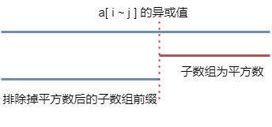

# 子数组偶数个因子

??? question "[codeforces 1731C](https://codeforces.com/problemset/problem/1731/C)"

    给定一个数组 `a[n]`，数组中的每一个元素 `a[i]` 都是正整数，且 $1 \leq$ `a[i]` $\leq n$；

    请你求出该数组中所有子数组，其子数组的所有元素异或值的因子是偶数的个数。

    **数据范围**

    $1 \leq$ n $\leq 2 \times 10 ^ 5$

    $1 \leq$ `a[i]` $\leq n$

    **输入格式**

    第一行输入一个正整数 `t` 代表测试样例的数量。

    对于每一个测试样例，第一行为一个整数 `n` 代表数组的长度，第二行 `n` 个正整数，分别代表数组的元素。

    **输出格式**

    输出 `t` 行，每行代表对应的测试样例答案。

## 探究其规律

**重要规律：a ^ a = 0, a ^ a ^ b = b, a ^ 0 = a**.

若我们知道了 `a[n]` 的异或前缀和数组为 `sum[n]`，那么子数组 `a[i ~ j]` 的异或值为：

> `sum[j] ^ sum[i - 1]`

若正整数 `ans` 有奇数个因子，那么 `ans` 一定是平方数，证明如下：

> `ans` 的因数都是成对出现的，按理来说 `ans` 的因数个数应该是偶数个，要想出现奇数个，则必有某对因子 `(x, y)`，并且 `x == y`，若 `x == y`，则 `ans = x * x` 是平方数。

数组 `a[n]` 的子数组总是为：

> `n * (n + 1) / 2`

若某连续的子数组的异或值是平方数，假设该平方数为 `x`，那么以该子数组为后缀的前缀和数组再一次异或该平方数一定会得到该前缀和数组去除该子数组后的前缀和数组，看图理解：



若子数组的异或值为平方数，那么以该 子数组 作为 后缀 的前缀和数组来说，异或上该平方数后得到的值必定是该前缀和数组不包含该子数组的前缀和数组的异或值。

当然，你可能会疑惑，万一不是连续的子元素异或后的值也是平方数怎么办？如果不是连续的话，其前缀和数组异或该平方数后的值一定不会作为前缀和数组出现，因为不连续。

我们只需要一个一个枚举平方数即可，无论有多少个数异或，其异或后的最大值，一定不会超过最大的数的两倍。

??? success "代码参考"

    ```c++
    #include <iostream>
    #include <cstring>

    using namespace std;
    typedef long long LL;
    const LL N = int (4e5 + 10);

    LL t, n, a[N], sum[N], res, mx;
    LL sq[N], cur;
    LL on[N];

    int main(void)
    {
        scanf ("%lld", &t);
        for (LL i = 0; i * i < N; i ++) sq[cur ++] = i * i;
        
        while (t --)
        {
            scanf ("%lld", &n);
            
            res = n * (n + 1) / 2;
            sum[0] = 0, mx = 0;
            
            for (int i = 1; i <= n; i ++)
            {
                scanf ("%lld", a + i);
                sum[i] = sum[i - 1] ^ a[i];
                mx = max(mx, sum[i]);
            }
            on[0] = 1;
            for (int i = 1; i <= n; i ++)
            {
                for (int j = 0; j < cur; j ++)
                {
                    if ((LL)(sum[i] ^ sq[j]) <= mx) 
                        res -= on[sum[i] ^ sq[j]];
                }
                on[sum[i]] ++;
            }
            
            for (int i = 1; i <= n; i ++) on[sum[i]] --;
            
            printf ("%lld\n", res);
        }
    }
    ```