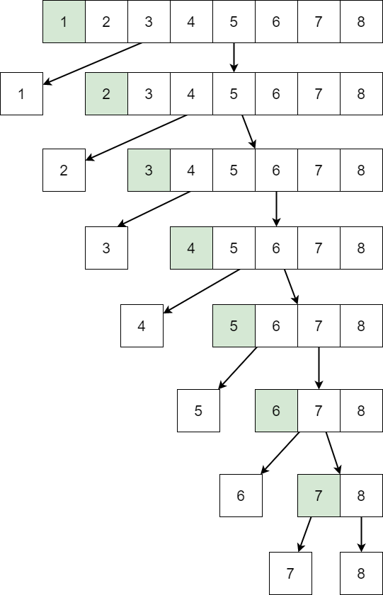

# 快速排序

最优复杂度是 $O(nlog(n))$ 但是最坏的情况下是 $O(n^2)$ 算法不稳定，有点依赖于哨兵坐标的选取和序列排列的特点。

一般来说，快速排序的哨兵坐标是可以随便选取的，选第一个也行，选中间的也许，甚至选随机的都行。

考虑选第一个作为哨兵的情形：

若选第一个作为哨兵，考虑一下已经排好序了的序列：$1,2,3,4,5,6,7,8$

哨兵值为 $1$，左指针从 $1$ 开始，右指针从 $8$ 开始，我们会发现左指针很难移动，只能一个一个的移动，但是右指针过掉比哨兵 $1$ 大的值往左靠拢的过程中，很容易就可以到达最左边，到下一轮快速排序时，就会划分成两部分：$[1]、[2,3,4,5,6,7,8]$ ，一直递归下去就会成为一颗斜树，高度为 $n$ ，每层执行 $n$ 次，此时的时间复杂的为 $O(n^2)$

??? info "快速排序斜树例图"

    {width=100%}

??? note "快速排序模板"

    ```c++
    LL a[N], n;

    void qsort(int l, int r)
    {
        if (l < r)
        {
            int x = a[(l + r) / 2];
            int i = l - 1, j = r + 1;
            while (i < j)
            {
                while (a[++ i] < x);
                while (x < a[-- j]);
                if (i < j) swap(a[i], a[j]);
            }
            qsort(l, j); qsort(j + 1, r);
        }
    }
    ```

??? note "快速排序求从小到大的第 k 个数"

    ```c++
    LL a[N], n, k, res, st;

    void qsort(int l, int r)
    {
        if (l < r && !st)
        {
            int x = a[(l + r) / 2];
            int i = l - 1, j = r + 1;
            while (i < j)
            {
                while (a[++ i] < x);
                while (x < a[-- j]);
                if (i < j) swap(a[i], a[j]);
            }
            qsort(l, j); qsort(j + 1, r);
        }
        else if (l == r && l == k) res = a[k], st = 1;
    }
    ```

??? question "中间数"

    给出 $N$ 个数（$N$ 为奇数）找到中间数并输出。

    **输入格式**

    第一行输入一个整数 $n$

    第二行输入 $n$ 个整数

    **输出格式**

    输出中间数

??? success "中间数代码参考"

    ```c++
    #include <iostream>

    using namespace std;

    typedef long long LL;

    const int N = 1e7 + 10;

    LL a[N], n, k, res, st;

    void qsort(int l, int r)
    {
        if (l < r && !st)
        {
            int x = a[(l + r) / 2];
            int i = l - 1, j = r + 1;
            while (i < j)
            {
                while (a[++ i] < x);
                while (x < a[-- j]);
                if (i < j) swap(a[i], a[j]);
            }
            qsort(l, j); qsort(j + 1, r);
        }
        else if (l == r && l == k) res = a[k], st = 1;
    }

    void solve()
    {
        scanf ("%lld", &n); k = (1 + n) / 2;
        for (int i = 1; i <= n; i ++) scanf ("%lld", a + i);
        qsort(1, n);
        cout << res << endl;
    }

    int main(void)
    {
        solve(); return 0;
    }
    ```