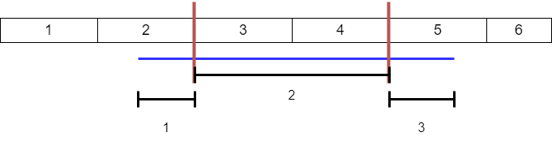

# 分块思想

稍慢但又不至于太慢的「区间和」分块做法

!!! note "例题 "
    给定一个长度为 $n$ 的序列 $\{a_i\}$，需要执行 $n$ 次操作。操作分两种：
    
    1. 给 $a_l \sim a_r$ 之间的所有数加上 $x$;
    2. 求 $\sum_{i=l}^{r}a_i$。

    $1 \leq n \leq 5 \times 10^4$ 

做法:

1. 将 $1 \sim n$ 按照 $sqrt(n)$ 分割成 $sqrt(n)$ 块，每一块都有其编号，最后一块可能长度小于 $sqrt(n)$ 但没有什么影响；
2. 先预处理出每一块的和 



假设我要求蓝色线的和，只需要暴力求块 $1、3$，然后加上之前预处理好的块 $2$ 即可；假设我要对蓝色线都加上某个特定值，只需要对块 $1、3$ 暴力加，对区间 $2$ 加上「该数 * 区间长度」就行。

## init 

下标为 $x$ 的元素所在的块为：$(x - 1) / sq + 1$，推导的时候假设 $x$ 在第 $k$ 块中（块的编号从 1 开始），则 $1 + k \cdot sq \leq x < 1 + (k + 1) \cdot sq$，化简之后可得：

$$
\begin{aligned}
k \leq \cfrac{x - 1}{sq} < k + 1
\end{aligned}
$$

由于执行的是向下除法，所以 $k = \cfrac{x - 1}{sq}$, 由于编号是从 $1$ 开始，我这样求得的编号是从 $0$ 开始，所以还要加上个 $1$：

$$
\begin{aligned}
    k = \cfrac{x - 1}{sq} + 1
\end{aligned}
$$

```c++
const int N = int (1e6 + 10);
int a[N], n; // a 表示数据数组，n 是数据长度，数据域从 1 开始
int id[N], sq; // id 表块的编号，sq = sqrt(n)
int b[N], s[N]; // b[i] 表示编号为 i 的块的数据增加值，s[i] 表示块 i 的区间和

void init()
{
    sq = sqrt(n);
    for (int i = 1; i <= n; i ++)
    {
        id[i] = (i - 1) / sq + 1;
        s[id[i]] += a[i];
    }
}
```

## add

区间加法

时间复杂度：$sqrt(n)$

如果 $l$ 和 $r$ 在同一个块内，直接对 $[l, r]$ 暴力加；

如果 $l$ 和 $r$ 不在同一个块内，先对 $l$ 所在的块、$r$ 所在的块对 $[l, r]$ 的交集暴力加，然后对被这两个块夹住的其他块加 `k*sq`，并记录下每一个元素加了什么值。

```c++
// 对区间 l、r 的元素都加上 k
void add(int l, int r, long long k)
{
    int sid = id[l], eid = id[r];
    if (sid == eid) // 说明 l 和 r 在同一个区间内
    {
        for (int i = l; i <= r; i ++) a[i] += k, s[sid] += k;
        return;
    }
    for (int i = l; id[i] == sid; i ++) a[i] += k, s[sid] += k;
    for (int i = r; id[i] == eid; i --) a[i] += k, s[eid] += k;
    for (int i = sid + 1; i < eid; i ++) s[i] += k * sq, b[i] += k;
}
```

## get_sum

获取区间和，get_sum

时间复杂度：$sqrt(n)$

```c++
long long get_sum(int l, int r)
{
    int sid = id[l], eid = id[r];
    long long ans = 0;
    if (sid == eid) 
    { // 在同一个块内直接暴力求和
        for (int i = l; i <= r; i ++) ans += a[i] + b[sid];
        return ans;
    }
    for (int i = l; id[i] == sid; i ++) ans += a[i] + b[sid]; // 对 l 所在的块与[l, r]的交集暴力求和
    for (int i = r; id[i] == eid; i --) ans += a[i] + b[eid]; // 对 r 所在的块与[l, r]的交集暴力求和
    for (int i = sid + 1; i < eid; i ++) ans += s[i]; // 对被 l 所在的块与 r 所在的块夹住的块求和
    return ans;
}
```

??? note "区间和分块--代码参考"

    ```c++
    const int N = int (1e6 + 10);
    long long a[N], n; // a 表示数据数组，n 是数据长度，数据域从 1 开始
    long long id[N], sq; // id 表块的编号，sq = sqrt(n)
    long long b[N], s[N]; // b[i] 表示编号为 i 的块的数据增加值，s[i] 表示块 i 的区间和

    void init()
    {
        sq = sqrt(n);
        for (int i = 1; i <= n; i ++)
        {
            id[i] = (i - 1) / sq + 1;
            s[id[i]] += a[i];
        }
    }

    // 对区间 l、r 的元素都加上 k
    void add(int l, int r, long long k)
    {
        int sid = id[l], eid = id[r];
        if (sid == eid) // 说明 l 和 r 在同一个区间内
        {
            for (int i = l; i <= r; i ++) a[i] += k, s[sid] += k;
            return;
        }
        for (int i = l; id[i] == sid; i ++) a[i] += k, s[sid] += k;
        for (int i = r; id[i] == eid; i --) a[i] += k, s[eid] += k;
        for (int i = sid + 1; i < eid; i ++) s[i] += k * sq, b[i] += k;
    }

    long long get_sum(int l, int r)
    {
        int sid = id[l], eid = id[r];
        long long ans = 0;
        if (sid == eid) 
        {
            for (int i = l; i <= r; i ++) ans += a[i] + b[sid];
            return ans;
        }
        for (int i = l; id[i] == sid; i ++) ans += a[i] + b[sid];
        for (int i = r; id[i] == eid; i --) ans += a[i] + b[eid];
        for (int i = sid + 1; i < eid; i ++) ans += s[i];
        return ans;
    }
    ```

??? note "例题  代码参考"
    ```c++
    // 即使是不成熟的尝试，

    const int N = int (1e6 + 10);
    long long a[N], n; // a 表示数据数组，n 是数据长度，数据域从 1 开始
    long long id[N], sq; // id 表块的编号，sq = sqrt(n)
    long long b[N], s[N]; // b[i] 表示编号为 i 的块的数据增加值，s[i] 表示块 i 的区间和

    void init()
    {
        sq = sqrt(n);
        for (int i = 1; i <= n; i ++)
        {
            id[i] = (i - 1) / sq + 1;
            s[id[i]] += a[i];
        }
    }

    // 对区间 l、r 的元素都加上 k
    void add(int l, int r, long long k)
    {
        int sid = id[l], eid = id[r];
        if (sid == eid) // 说明 l 和 r 在同一个区间内
        {
            for (int i = l; i <= r; i ++) a[i] += k, s[sid] += k;
            return;
        }
        for (int i = l; id[i] == sid; i ++) a[i] += k, s[sid] += k;
        for (int i = r; id[i] == eid; i --) a[i] += k, s[eid] += k;
        for (int i = sid + 1; i < eid; i ++) s[i] += k * sq, b[i] += k;
    }

    long long get_sum(int l, int r, long long p)
    {
        int sid = id[l], eid = id[r];
        long long ans = 0;
        if (sid == eid) 
        {
            for (int i = l; i <= r; i ++) ans = (ans + a[i] + b[sid]) % p;
            return ans;
        }
        for (int i = l; id[i] == sid; i ++) ans = (ans + a[i] + b[sid]) % p;
        for (int i = r; id[i] == eid; i --) ans = (ans + a[i] + b[eid]) % p;
        for (int i = sid + 1; i < eid; i ++) ans = (ans + s[i]) % p;
        return ans;
    }

    void solve(void)
    {
        scanf ("%lld", &n);
        for (int i = 1; i <= n; i ++) scanf ("%lld", a + i);
        init();
        for (int i = 1; i <= n; i ++)
        {
            long long t, a, b, c; scanf ("%lld%lld%lld%lld", &t, &a, &b, &c);
            if (t == 0) add(a, b, c);
            else printf ("%lld\n", get_sum(a, b, c + 1));
        }
    }

    // 也胜于胎死腹中的策略。
    ```