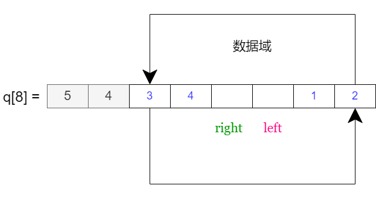
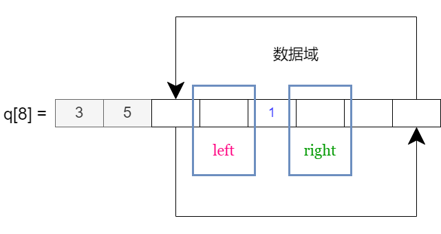
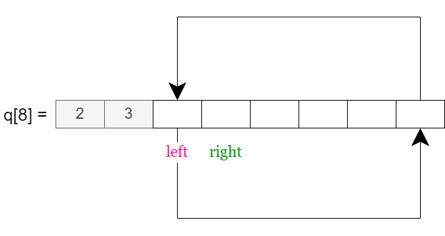
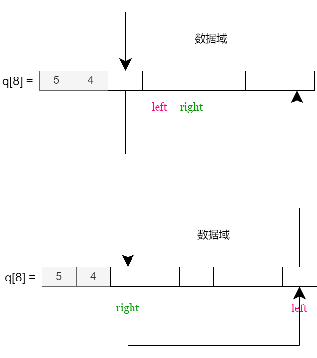

# 双端队列

两端都能进或出

## 数组版-双端队列

规定 $q[0]$ 是左指针，$q[1]$ 是右指针，并且左右指针都能往左或者往右移动

??? note "双端队列示意图"
    

### init 初始化

我们规定，数组下标为 $q[0]$、$q[1]$ 的数据域不能存放数据，即 $q[q[0]]$ 和 $q[q[1]]$ 不能放数据， 初始化时，$q[0] = 2, q[1] = 3$


??? note "双端队列-不能放数据的两个下标"
    

??? note "双端队列-初始状态图片"
    

```cpp
void init(int q[])
{
    q[0] = 2, q[1] = 3;
}
```

### ml 左边元素下标

- 如果 pos != 2 ，则 ml = pos - 1
- 否则 ml = N - 1

若 $i$ 是区间 $[0, N - 3]$ 的元素，左移就相当于是 $i - 1$ 对 $N - 2$ 同余操作，即 $(i - 1) \bmod (N - 2)$

已知 $pos$ 是区间 $[2, N - 1]$ 的元素，也是 $[0, N - 3] + 2$ 的元素，$pos$ 左移就相当于是 $(pos - 2 - 1) \bmod (N - 2) + 2 = (pos - 2 - 1 + N - 2) \bmod (N - 2) + 2$

``` c++
int ml(int pos)
{
    return (pos - 5 + N) % (N - 2) + 2;
}
```

### mr 右边元素的下标

- 如果 pos != N-1 ，则 mr = pos + 1
- 否则 ml = 2

已知 $pos$ 的取值范围：$[2, N-1]$ ，在该区间内右移，就相当于在区间 $[0, N - 3]$ 内右移，需要先 $pos - 2$ 化成区间 $[0, N - 3]$ 内的元素，再对右移操作 $(pos - 2 + 1) \bmod ( N - 2)$ 同余

``` c++
int mr(int pos)
{
    return (pos - 1) % (N - 2) + 2;
}
```

### empty

只要 $q[0]$ 紧跟在 $q[1]$ 的左手边，就说明双端队列为空

??? note "双端队列空状态图例"

    


```cpp
bool empty(int q[])
{
    return ml(q[1]) == q[0];
}
```

### size

如果 $q[1] > q[0]$，$size = q[1] - q[0] - 1$；

如果 $q[1] < q[0]$，$size = (q[1] - 2) + (N - q[0] - 1) = (q[1] - q[0] - 1) +  N - 2$；

综上：$size = (q[1] - q[0] - 1 +  N - 2) \bmod (N - 2)$

```cpp
int size(int q[])
{
    return  (q[1] - q[0] - 1 +  N - 2) % (N - 2);
}
```

### full

实际上，数组能用的空间只有 $N - 4$

```cpp
bool full(int q[])
{
	return size(q) == N - 4;
}
```

### push_left 往左插

```c++
void push_left(int q[], int x)
{
    q[q[0]] = x; q[0] = ml(q[0]);
}
```

### push_right 往右插

```c++
void push_right(int q[], int x)
{
    q[q[1]] = x; q[1] = mr(q[1]);
}
```

### pop_left 删左边

```cpp
int top_left(int q[])
{
    return q[mr(q[0])];
}

void pop_left(int q[])
{
    q[0] = mr(q[0]);
}
```

### pop_right 删右边

```cpp
int top_right(int q[])
{
    return q[ml(q[1])];
}

void pop_right(int q[])
{
    q[1] = ml(q[1]);
}
```

??? note "双端队列-数组版-代码汇总"

    ```cpp
    const int N = int (1e6 + 10);
    int q[N];

    void init(int q[])
    {
        q[0] = 2, q[1] = 3;
    }

    int ml(int pos)
    {
        return (pos - 5 + N) % (N - 2) + 2;
    }

    int mr(int pos)
    {
        return (pos - 1) % (N - 2) + 2;
    }

    bool empty(int q[])
    {
        return ml(q[1]) == q[0];
    }

    int size(int q[])
    {
        return  (q[1] - q[0] - 1 +  N - 2) % (N - 2);
    }

    bool full(int q[])
    {
        return size(q) == N - 4;
    }

    void push_left(int q[], int x)
    {
        q[q[0]] = x; q[0] = ml(q[0]);
    }

    void push_right(int q[], int x)
    {
        q[q[1]] = x; q[1] = mr(q[1]);
    }

    int top_left(int q[])
    {
        return q[mr(q[0])];
    }

    void pop_left(int q[])
    {
        q[0] = mr(q[0]);
    }

    int top_right(int q[])
    {
        return q[ml(q[1])];
    }

    void pop_right(int q[])
    {
        q[1] = ml(q[1]);
    }
    ```