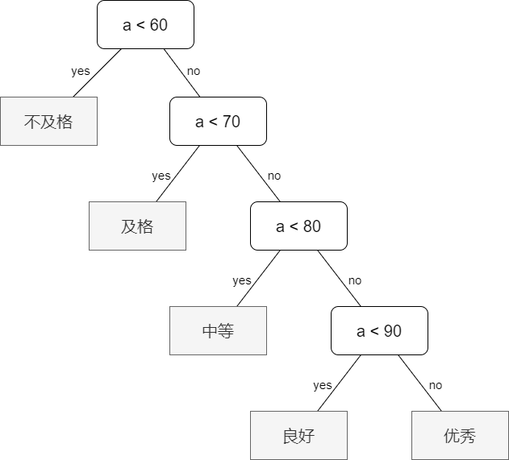
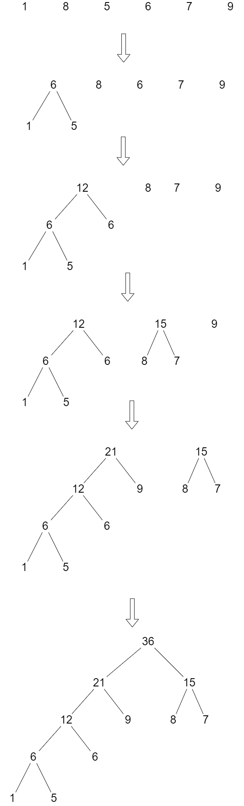

# 哈夫曼树

## 引例

班上有 5 人不合格，15 人 及格，40 人中等，30 人良好，10 人 优秀，并规定等级分布情况如下表:

|`等级`|不及格|及格|中等|良好|优秀|
|:--:|:--:|:--:|:--:|:--:|:--:|
|`分数`| $0 \sim 59$ | $60 \sim 69$ | $70 \sim 79$ | $80 \sim 89$ | $90 \sim 100$ |
|`人数占比`| $5\%$ | $15\%$ | $40\%$ | $30\%$ | $10\%$ |

老师设计了一个函数来处理学生的分数等级：

```c++
void f(int a)
{
    if (a < 60) printf ("不及格\n");
    else if (a < 70) printf ("及格\n");
    else if (a < 80) printf ("中等\n");
    else if (a < 90) printf ("良好\n");
    else printf ("优秀\n");
}
```

该程序的执行顺序是：

{width=60%}

该程序的执行效率是有问题的，因为我们发现成绩低于 $60$ 的学生仅占 $5\%$，而高于 $70$ 分的学生却占了大多数 $80\%$，假设该老师就用此程序来给学生划分等级，我们来算一下该程序总共执行了多少步：

$$
5 + 15 * 2 + 40 * 3 + 30 * 4 + 10 * 4 = 315
$$

如果我们把分布越多，就越放开头会是怎样的情况呢？考虑下方的程序图：

{width=80%}

我们来算一下使用该程序来给学生划分等级需要执行多少步：

$$
5 * 3 + 15 * 3 + 40 * 2 + 30 * 2 + 10 * 2 = 220
$$

该程序较之上面的程序差点就优化了 $1/3$ 的效率！

## 定义与原理

**带权路径长度 WPL**：从「根节点」到各「叶节点」的路径长度与相应叶节点的权值的乘积之和

{width=50%}

如上图的 **WPL** 的计算方法是：

$$
WPL\ :\ 2 * 2 + 3 * 2 + 4 * 2 + 5 * 2 = 28
$$

哈夫曼树每一个节点度，要么是 2 要么是 0，不存在 1 的情况。

假设要对权值数组 `nums` 建立哈夫曼树，则每一个权值都会作为叶子节点存在哈夫曼树中。

建树步骤：

1. **初始化：** 由给定的 $n$ 个权值构造 $n$ 棵只有一个节点的二叉树，得到一个二叉树集合 $F$。
2. **选取与合并：** 从集合 $F$ 中选取两棵「根节点的权值最小」的二叉树，计算出他们的根节点的权值之和，以该权值之和作为新的根节点，那两棵最小的二叉树分别作为该新的根节点的左右子树，将该新树插入到集合 $F$ 中。
3. 不断重复步骤 2 直到集合 $F$ 只剩下一棵二叉树，该树就是哈夫曼树。

??? info "建树示例图"

    {width=100%}

??? note "哈夫曼树建树代码参考"

    ```c++
    struct Node
    {
        int w; Node* l, * r;
        Node(int weight, Node* left, Node* right)
        {
            w = weight; l = left; r = right;
        }
    };

    const int inf = ~(1 << 31);

    Node* init(const vector<int>& nums)
    {
        Node* F[nums.size() + 1];
        for (int i = 1; i <= nums.size(); i ++)
            F[i] = new Node(nums[i - 1]);

        // 两两合并，要合并 n - 1 次
        for (int a = 1; a < n; a ++)
        {
            // min1 是最小值的下标，min2 是次最小值的下标
            int min1, min2; min1 = min2 = inf;

            // 先找到不为 「空」 的两个节点
            for (int i = 1; i <= n; i ++)
            {
                if (F[i] && min1 == inf)
                {
                    min1 = i; continue;
                }
                else if (F[i])
                {
                    min2 = i; break;
                }
            }

            // 寻找最小值，寻找最大值
            for (int i = min2; i <= n; i ++)
            {
                if (F[i])
                {
                    if (F[i]->w <= F[min1]->w) 
                    {
                        min2 = min1; min1 = i;
                    }
                    else if (F[i]->w <= F[min2]->w)
                        min2 = i;
                }
            }

            // 建立新树
            Node* root = new Node(F[min1]->w + F[min2]->w, F[min1], F[min2]);
            F[min1] = root;
            F[min2] = nullptr;
        }
        
        return root;
    }

    int get_wpl(Node* a, int h = 0)
    {
        if (a == nullptr) return 0;
        if (!a->l && !a->r) return a->w * h;
        return get_wpl(a->l, h + 1) + get_wpl(a->r, h + 1);
    }
    ```

??? note "不用建好哈夫曼树，直接求 WPL"

    ```c++

    ```