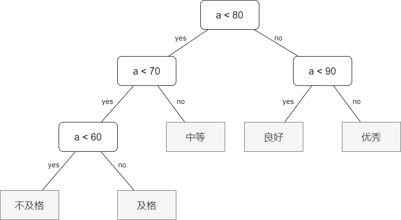

# 哈夫曼树

## 引例

班上有 5 人不合格，15 人 及格，40 人中等，30 人良好，10 人 优秀，并规定等级分布情况如下表:

|`等级`|不及格|及格|中等|良好|优秀|
|:--:|:--:|:--:|:--:|:--:|:--:|
|`分数`| $0 \sim 59$ | $60 \sim 69$ | $70 \sim 79$ | $80 \sim 89$ | $90 \sim 100$ |
|`人数占比`| $5\%$ | $15\%$ | $40\%$ | $30\%$ | $10\%$ |

老师设计了一个函数来处理学生的分数等级：

```c++
void f(int a)
{
    if (a < 60) printf ("不及格\n");
    else if (a < 70) printf ("及格\n");
    else if (a < 80) printf ("中等\n");
    else if (a < 90) printf ("良好\n");
    else printf ("优秀\n");
}
```

该程序的执行顺序是：

{width=60%}

该程序的执行效率是有问题的，因为我们发现成绩低于 $60$ 的学生仅占 $5\%$，而高于 $70$ 分的学生却占了大多数 $80\%$，假设该老师就用此程序来给学生划分等级，我们来算一下该程序总共执行了多少步：

$$
5 + 15 * 2 + 40 * 3 + 30 * 4 + 10 * 4 = 315
$$

如果我们把分布越多，就越放开头会是怎样的情况呢？考虑下方的程序图：

{width=80%}

我们来算一下使用该程序来给学生划分等级需要执行多少步：

$$
5 * 3 + 15 * 3 + 40 * 2 + 30 * 2 + 10 * 2 = 220
$$

该程序较之上面的程序差点就优化了 $1/3$ 的效率！

## 定义与原理

