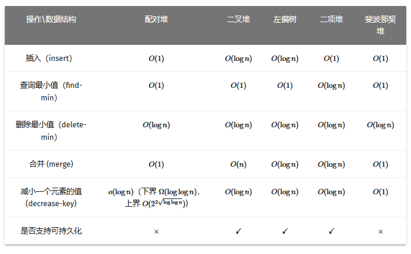

# 左偏树

左偏树的含义是只能允许左子树的深度比右子树的深，合并堆时，取最小的根作为新堆的根，将另外一个堆与该最小堆的右子树重复执行上述操作，合并后如果出现左子树的高度小于右子树的高度，要交换左右子树，因此左边的树都会比右边的高，这样做的好处能将合并堆的时间复杂度降低至 $O(log(n) + log(m))$

配对堆的合并时间复杂度是 $O(1)$ 但删除根节点的时间复杂度为 $O(log(n))$

左偏树合并的时间复杂度虽然是 $O(log(n + m))$ 删除根节点的时间复杂度也差不多是 $O(log(n + m))$

??? note "时间复杂度对比图"

    

## 结构体定义

需要用 dist 来存储当前节点距离最近叶子节点的路径长度，实际上 `a.d = min(a.l.d, a.r.d) + 1`

我们规定 `nullptr` 的 dist 值为 0，叶子节点的 dist 就是 1。

```c++
struct Node
{
    int v, d;
    Node* l, * r;
};

int d(Node* a)
{
    if (!a) return 0;
    return a->d;
}
```

## meld 合并两堆

如果这两堆有「空堆」直接返回另外一个堆；

在这两堆中寻找最小的堆，暂且称呼它为 a，称呼另外一个堆为 b，将最小的堆 a 的右孩子与堆 b 执行上述合并操作；

执行完之后，如果左子树的 dist 小于右子树的 dist，交换左右子树，并返回新的根节点。

```c++
Node* meld(Node* a, Node* b)
{
    if (!a || !b) return a ? a : b;
    if (a->v > b->v) swap<Node*>(a, b);
    a->r = meld(a->r, b);
    if (d(a->l) < d(a->r)) swap<Node*>(a->l, a->r);
    a->d = d(a->r) + 1;
    return a;
}
```

## meld 合并新元素

将新元素作为新堆合并

```c++
Node* meld(Node* a, int x)
{
    Node* t = new Node{x, 1, nullptr, nullptr};
    return meld(a, t);
}
```

## front 获取最小值

```c++
int front(Node* a)
{
    return a->v;
}
```

## pop 删除根节点

删除根节点，并对左右子堆合并，返回新根节点

```c++
Node* pop(Node* a)
{
    Node* t = meld(a->l, a->r);
    delete a; return t;
}
```

## empty

```c++
bool empty(Node* a)
{
    return !a;
}
```

??? note "左偏树代码汇总"

    ```c++
    struct Node
    {
        int v, d;
        Node* l, * r;
    };

    int d(Node* a)
    {
        if (!a) return 0;
        return a->d;
    }

    Node* meld(Node* a, Node* b)
    {
        if (!a || !b) return a ? a : b;
        if (a->v > b->v) swap<Node*>(a, b);
        a->r = meld(a->r, b);
        if (d(a->l) > d(a->r)) swap<Node*>(a->l, a->r);
        a->d = d(a->r);
        return a;
    }

    Node* meld(Node* a, int x)
    {
        Node* t = new Node{x, 1, nullptr, nullptr};
        return meld(a, t);
    }

    int front(Node* a)
    {
        return a->v;
    }

    Node* pop(Node* a)
    {
        Node* t = meld(a->l, a->r);
        delete a; return t;
    }

    bool empty(Node* a)
    {
        return !a;
    }
    ```