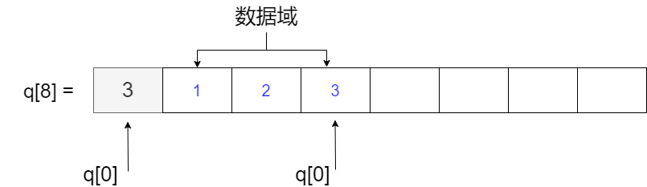

# 栈

栈是一种「先进后出」的数据结构。

## 数组实现栈

用数组实现栈，代码简洁，效率也高，速度也快

给定一个数组 $q[N]$，数组的第一个元素 $q[0]$ 存储栈的数据个数，也代表最后一个元素的下标，如下图：



### empty

如果 $q[0] = 0$ ，说明栈为空

``` c++
#define st_empty(st) (st[0] == 0) // 判断栈是否为 空
```

### full

如果 $q[0] = N - 1$，说明数组空间已满

``` c++
#define st_full(st) (st[0] == (N - 1)) // 栈的长度最大为 N - 1
```

### push

插入数据时：`q[++q[0]] = x`

``` c++
#define st_push(st, x) (st[++st[0]] = (x)) // 放入数据
```

### pop

取出数据时：`q[q[0]--]`

``` c++
#define st_pop(st) (st[st[0]--]) // 拿出数据

#define st_top(st) (st[st[0]]) // 访问栈顶元素
```

??? note "栈-代码参考"
    ```cpp linenums="1"
    const int N = int (1e5 + 10);

    int q[N]; // 使用 q[0] 表示 栈 的数据个数

    #define st_size(st) (st[0]) // 栈的数据个数

    #define st_full(st) (st[0] == (N - 1)) // 栈的长度最大为 N - 1

    #define st_empty(st) (st[0] == 0) // 判断栈是否为 空

    #define st_push(st, x) (st[++st[0]] = (x)) // 放入数据

    #define st_pop(st) (st[st[0]--]) // 拿出数据

    #define st_top(st) (st[st[0]]) // 访问栈顶元素
    ```

## 结构体

### 结构体定义

```c++ 
struct Node
{
    int v;
    Node* ne;
    Node(int val = 0, Node* next = nullptr)
    {
        v = val; ne = next;
    }
};
```

### 头插法

定义一个 `st_top` 指针指向开头，初始化为「空」

``` c++
Node* st_top = nullptr;
```

### push 压栈

假设我们要加入一个数据，我们采用头插法不断维护栈顶即可

``` c++
void push(Node*& st_top, int x)
{
    Node* t = new Node(x, st_top);
    st_top = t;
}
```

### pop 取出栈顶

```c++
int top(Node* st_top)
{
    return st_top->v;
}

void pop(Node*& st_top)
{
    Node* p = st_top; 
    st_top = st_top->ne;
    delete p;
}
```

### empty

```c++
bool empty(Node* st_top)
{
    return !st_top;
}
```

??? note "结构体-代码汇总"

    ```c++ linenums="1"
    struct Node
    {
        int v;
        Node* ne;
        Node(int val = 0, Node* next = nullptr)
        {
            v = val; ne = next;
        }
    };

    Node* st_top = nullptr;

    void push(Node*& st_top, int x)
    {
        Node* t = new Node(x, st_top);
        st_top = t;
    }

    int top(Node* st_top)
    {
        return st_top->v;
    }

    void pop(Node*& st_top)
    {
        Node* p = st_top; 
        st_top = st_top->ne;
        delete p;
    }

    bool empty(Node* st_top)
    {
        return !st_top;
    }
    ```