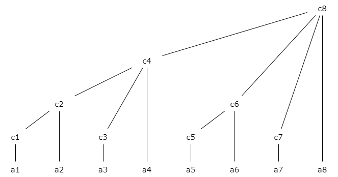

# 树状数组

树状数组可以很快的求出区间和。

??? info "树状数组举例图"

    {width=100%}

```text
ci 管理的区间为: [i - lowbit(i) + 1, i]
   管理的长度为：lowbit(i)

ci 的父节点 cp: p = i + lowbit(i)

ci 管理的区间是 [i - lowbit(i) + 1, i]，那么 令 j = i - lowbit(i) 
则 cj = [j - lowbit(j) + 1, j = i - lowbit(i)] 就是 ci 左相邻的区间。
```

改变某个节点的值时，要更新该节点的所有上级。

## lowbit 获取 x 的最右边的 1

```c++
// 101000
// 010111 + 1 = 011000
// 101000 & 011000 = 001000 = 8
int lowbit(int x)
{
    return (~x + 1) & x;
}
```

## init 造树

方法一：

假设 $a[N]$ 是数据数组，参考树的结构，我们发现可以不断的通过子节点的值累加确定父节点的值：

??? info "树状数组举例图"

    {width=100%}

    从左往右扫描，通过确定 `c2、c3、a4` 的值推导出 `c4` 的值。

```c++
void init()
{
    for (int i = 1; i <= n; i ++)
    {
        c[i] += a[i];
        if ((j = lowbit(i)) <= n) c[j] += c[i];
    }
}
```

方法二：

预处理出前缀和数组。

```c++
ci 管理的区间是 [i - lowbit(i) + 1, i]
   ci = s[i] - s[i - lowbit(i)]
```

代码：

```c++
void init()
{
    for (int i = 1; i <= n; i ++)
        c[i] = s[i] - s[i - lowbit(i)];
}
```

## getsum 获取前缀和

不断求和 `ci` 左边管理的区块。

```c++
ci 管理的区间是 [i - lowbit(i) + 1, i]，那么 令 j = i - lowbit(i) 
   则 cj = [j - lowbit(j) + 1, j = i - lowbit(i)] 就是 ci 左相邻的区间。
```

代码：

```c++
long long getsum(int pos)
{
    long long ans = 0;
    while (pos >= 1)
    {
        ans += c[pos]; pos = pos - lowbit(pos);
    }
    return ans;
}
```

## add 给某数据增加值

改变某个节点的值时，要更新该节点的所有上级。

```c++
ci 的父节点 cp: p = i + lowbit(i)
```

代码：

```c++
void add(int pos, int x)
{
    while (pos <= n)
    {
        c[pos] = c[pos] + x; pos = pos + lowbit(pos);
    }
}
```