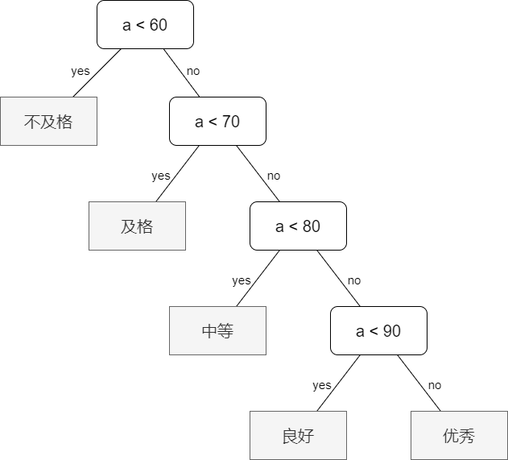
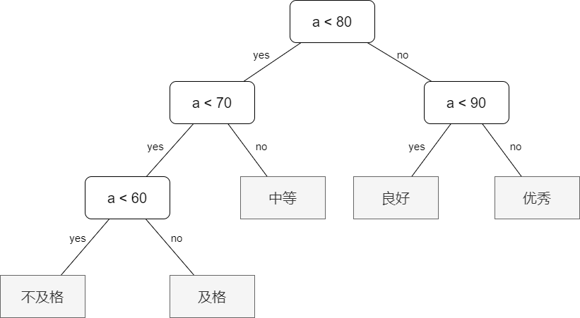
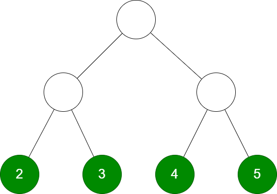
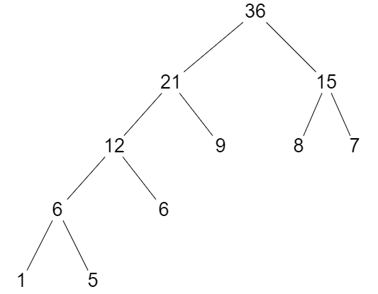
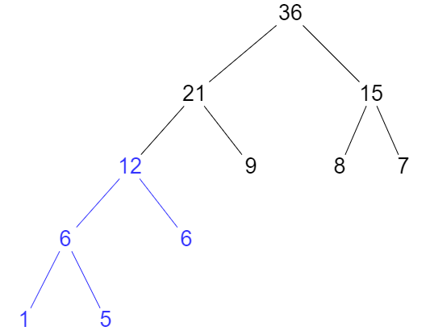
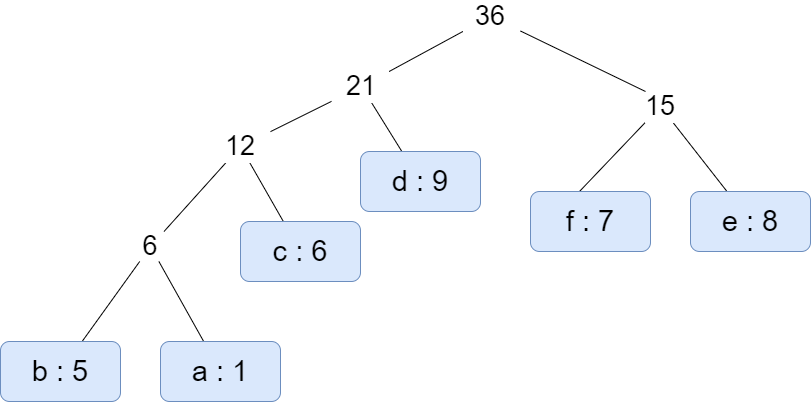

# 霍夫曼树

## 引例

班上有 5 人不合格，15 人 及格，40 人中等，30 人良好，10 人 优秀，并规定等级分布情况如下表:

|`等级`|不及格|及格|中等|良好|优秀|
|:--:|:--:|:--:|:--:|:--:|:--:|
|`分数`| $0 \sim 59$ | $60 \sim 69$ | $70 \sim 79$ | $80 \sim 89$ | $90 \sim 100$ |
|`人数占比`| $5\%$ | $15\%$ | $40\%$ | $30\%$ | $10\%$ |

老师设计了一个函数来处理学生的分数等级：

```c++
void f(int a)
{
    if (a < 60) printf ("不及格\n");
    else if (a < 70) printf ("及格\n");
    else if (a < 80) printf ("中等\n");
    else if (a < 90) printf ("良好\n");
    else printf ("优秀\n");
}
```

该程序的执行顺序是：

{width=60%}

该程序的执行效率是有问题的，因为我们发现成绩低于 $60$ 的学生仅占 $5\%$，而高于 $70$ 分的学生却占了大多数 $80\%$，假设该老师就用此程序来给学生划分等级，我们来算一下该程序总共执行了多少步：

$$
5 + 15 * 2 + 40 * 3 + 30 * 4 + 10 * 4 = 315
$$

如果我们把分布越多，就越放开头会是怎样的情况呢？考虑下方的程序图：

{width=80%}

我们来算一下使用该程序来给学生划分等级需要执行多少步：

$$
5 * 3 + 15 * 3 + 40 * 2 + 30 * 2 + 10 * 2 = 220
$$

该程序较之上面的程序差点就优化了 $1/3$ 的效率！

## 定义与原理

**带权路径长度 WPL**：从「根节点」到各「叶节点」的路径长度与相应叶节点的权值的乘积之和

{width=50%}

如上图的 **WPL** 的计算方法是：

$$
WPL\ :\ 2 * 2 + 3 * 2 + 4 * 2 + 5 * 2 = 28
$$

霍夫曼树每一个节点度，要么是 2 要么是 0，不存在 1 的情况。

假设要对权值数组 `nums` 建立霍夫曼树，则每一个权值都会作为叶子节点存在霍夫曼树中。

建树步骤：

1. **初始化：** 由给定的 $n$ 个权值构造 $n$ 棵只有一个节点的二叉树，得到一个二叉树集合 $F$。
2. **选取与合并：** 从集合 $F$ 中选取两棵「根节点的权值最小」的二叉树，计算出他们的根节点的权值之和，以该权值之和作为新的根节点，那两棵最小的二叉树分别作为该新的根节点的左右子树，将该新树插入到集合 $F$ 中。
3. 不断重复步骤 2 直到集合 $F$ 只剩下一棵二叉树，该树就是霍夫曼树。

??? info "建树示例图"

    {width=100%}

## WPL 计算规律

考虑下面一棵霍夫曼树：

{width=60%}

数据节点均是叶子节点。

该树的 WPL：

$$
WPL = 1 * 4 + 5 * 4 + 6 * 3 + 9 * 2 + 8 * 2 + 7 * 2 = 90
$$

我们考虑一下非根节点的所有权值之和 sum：

$$
sum = 1 + 5 + 6 + 6 + 12 + 9 + 21 + 8 + 7 + 15 = 90
$$

我们确实有这样的结论：$WPL$ 的值等于「非根节点的所有权值之和」。

我们可以从构造的角度去分析，每合并出一个节点，就相当于叶子节点多加了一次，由叶子节点 1、5 合并出 6，则该 6 就代表 1 和 5 多加了一次；由 左边的 6 和 叶子节点 6 合并出 12，就代表 1、5、6 又多加了一次，剩下的请读者自己类推。

{width=50%}

??? info "STL 的优先队列 priority_queue"

    1. `top` 访问最值
    2. `empty` 队列是否为空
    3. `size` 返回队列内数据个数
    4. `push` 插入新数据进优先队列
    5. `pop` 删除队头元素
    6. `priority_queue <type, vector<type>, cmp(type a, type b)> q; `
    7. `bool cmp(int a, int b) { return a < b; } ` 就会实现「大根堆」。现成的有 `greater<type>` 实现「小根堆」，`less<type>` 实现「大根堆」。

??? note "给定了权值数组，求 WPL"

    方法一：借助「优先队列（堆）」
    
    ```c++
    long long get_wpl(const vector<int>& nums)
    {
        priority_queue<int, vector<int>, greater<int>> qu(nums.begin(), nums.end());
        long long ans = 0;
        while (qu.size() > 1)
        {
            int a = qu.top(); qu.pop();
            int b = qu.top(); qu.pop();
            int t = a + b;
            ans = ans + t; 
            qu.push(t);
        }
        return ans;
    }
    ```

    方法二：有现成的霍夫曼树的情况下

    ```c++
    int get_wpl(Node* a, int h = 0)
    {
        if (a == nullptr) return 0;
        if (!a->l && !a->r) return a->w * h;
        return get_wpl(a->l, h + 1) + get_wpl(a->r, h + 1);
    }
    ```

## 霍夫曼编码

随机函数生成 `10 ^ 6` 个小写字母

```c++
void data()
{
    srand((unsigned int)time(NULL));
    for (int i = 1; i <= 1e6; i ++) printf ("%c", rand() % 26 + 'a');
    puts("");
}
```

统计每一个字母出现次数：

```c++
const int N = int (1e7 + 10);
char s[N]; int cnt[26];

void solve(void)
{
    scanf ("%s", s);
    for (int i = 0; s[i]; i ++)
        cnt[s[i] - 'a'] ++;
}
```

根据字母出现的次数作为权值，建立霍夫曼树，由于小写字母有 26 个，则会有 26 个叶子节点，该叶子节点构成的集合就是权值构成的集合。

从根节点出发往下寻找叶子节点，定义往左走输出 0，往右走输出 1，一直走到叶子节点所输出的编码就是该叶子节点的「霍夫曼编码」。你也可以规定走到儿子中最大权值的为 1，最小的为 0，随意。

??? note "「小写字母 - 霍夫曼编码举例」"

    |`字母`|a|b|c|d|e|f|
    |:--:|:--:|:--:|:--:|:--:|:--:|:--:|
    |`出现次数`|1|5|6|9|8|7|

    由此构成的霍夫曼树如下图：

    ??? info "霍夫曼编码举例图"

        {width=100%}
    
    则 `a` 对应的霍夫曼编码为：`0001`；`f` 对应的霍夫曼编码为：`10`；剩下的依此类推

霍夫曼编码代码参考：（建好霍夫曼树后再传递给该函数求值）

??? note "霍夫曼建树+霍夫曼编码代码参考"

    ```c++ title="统计小写字母的霍夫曼编码" linenums="1"
    #include <bits/stdc++.h>

    using namespace std;
    int debuggersum = 0;

    // 即使是不成熟的尝试，

    struct Node
    {
        char c; int w; Node* l, * r;
        Node(char chr = 0, int weight = 0, Node* left = nullptr, Node* right = nullptr)
        {
            c = chr; w = weight; l = left; r = right;
        }
    };

    const int inf = ~(1 << 31);

    Node* create(vector<vector<int>> dts)
    {
        int n = dts.size();
        Node* F[n], * root;
        for (int i = 0; i < n; i ++)
        {
            F[i] = new Node{char(dts[i][0]), dts[i][1], nullptr, nullptr};
        }

        // 执行 n - 1 次
        for (int k = 1; k < n; k ++)
        {
            int m1, m2; m1 = m2 = inf; // m1 是最小值的下标，m2 是次最小值的下标

            // 先找到两个非空节点的下标
            for (int i = 0; i < n; i ++)
            {
                if (F[i] && m1 == inf)
                {
                    m1 = i; continue;
                }
                else if (F[i]) 
                {
                    m2 = i; break;
                }
            }

            // 确定两个最小值
            for (int i = m2; i < n; i ++)
            {
                if (F[i])
                {
                    if (F[i]->w <= F[m1]->w)
                    {
                        m2 = m1; m1 = i;
                    }
                    else if (F[i]->w < F[m2]->w)
                        m2 = i;
                }
            }

            root = new Node{0, F[m1]->w + F[m2]->w, F[m1], F[m2]};
            F[m1] = root; F[m2] = nullptr;
        }

        return root;
    }

    int get_wpl(Node* a, int h = 0)
    {
        if (!a) return 0;
        if (!a->l && !a->r) return a->w * h;
        return get_wpl(a->l, h + 1) + get_wpl(a->r, h + 1);
    }

    const int N = int (1e7 + 10);
    char s[N]; int cnt[26];
    string hff[26];

    void haff(Node* a, string path = string())
    {
        if (!a) return;
        if (!a->l && !a->r)
        {
            hff[a->c - 'a'] = path; return;
        }
        haff(a->l, path + '0');
        haff(a->r, path + '1');
    }

    void solve(void)
    {
        scanf ("%s", s);
        vector<vector<int>> dts;
        for (int i = 0; s[i]; i ++) cnt[s[i] - 'a'] ++;
        for (int i = 0; i < 26; i ++) dts.push_back({i + 'a', cnt[i]});
        Node* a = create(dts);
        haff(a);
        for (int i = 0; i < 26; i ++)
            cout << char(i + 'a') << " 的霍夫曼编码为: " << hff[i] << endl;
    }

    // 也胜于胎死腹中的策略。

    int main(void)
    {
        ifstream fi; ofstream fo;
        fi.open("./lrq.in"); fo.open("./lrq.out");
        if (fi.is_open() && fo.is_open())
        {
            fo << "start running ..." << endl; fo.close(); fi.close();
            for (long long i = 1; i <= 4e8 + 2e7; i++);
            FILE *fin = freopen("./lrq.in", "r", stdin);
            FILE *fout = freopen("./lrq.out", "w", stdout);
            solve(); fclose(fin); fclose(fout);
        }
        else solve();

        return 0;
    }
    ```

??? note "霍夫曼树建树代码参考"

    ```c++ linenums="1"
    struct Node
    {
        int w; Node* l, * r;
        Node(int weight = 0, Node* left = nullptr, Node* right = nullptr)
        {
            w = weight; l = left; r = right;
        }
    };

    const int inf = ~(1 << 31);

    Node* init(const vector<int>& nums)
    {
        int n = nums.size();
        Node* F[nums.size() + 1];
        for (int i = 1; i <= nums.size(); i ++)
            F[i] = new Node(nums[i - 1]);

        Node* root;
        // 两两合并，要合并 n - 1 次
        for (int a = 1; a < n; a ++)
        {
            // min1 是最小值的下标，min2 是次最小值的下标
            int min1, min2; min1 = min2 = inf;

            // 先找到不为 「空」 的两个节点
            for (int i = 1; i <= n; i ++)
            {
                if (F[i] && min1 == inf)
                {
                    min1 = i; continue;
                }
                else if (F[i])
                {
                    min2 = i; break;
                }
            }

            // 寻找最小值，寻找最大值
            for (int i = min2; i <= n; i ++)
            {
                if (F[i])
                {
                    if (F[i]->w <= F[min1]->w) 
                    {
                        min2 = min1; min1 = i;
                    }
                    else if (F[i]->w <= F[min2]->w)
                        min2 = i;
                }
            }

            // 建立新树
            root = new Node(F[min1]->w + F[min2]->w, F[min1], F[min2]);
            F[min1] = root;
            F[min2] = nullptr;
        }

        return root;
    }

    int get_wpl(Node* a, int h = 0)
    {
        if (a == nullptr) return 0;
        if (!a->l && !a->r) return a->w * h;
        return get_wpl(a->l, h + 1) + get_wpl(a->r, h + 1);
    }
    ```

??? note "不用建好霍夫曼树，直接求 WPL"

    ```c++
    long long get_wpl(const vector<int>& nums)
    {
        priority_queue<int, vector<int>, greater<int>> qu(nums.begin(), nums.end());
        long long ans = 0;
        while (qu.size() > 1)
        {
            int a = qu.top(); qu.pop();
            int b = qu.top(); qu.pop();
            int t = a + b;
            ans = ans + t; 
            qu.push(t);
        }
        return ans;
    }
    ```