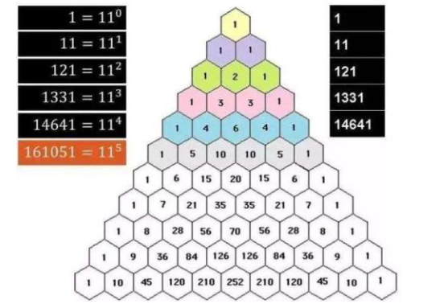

# n 中取 r

!!! note "题目一"

    在 $n$ 个相异的物件中取 $r$ 个的不同排列总数。

$p_r^n = A_r^n = n (n - 1) (n - 2) \cdots (n - r + 1) = \frac{n!}{(n - r)!}$

---

!!! note "题目二"

    在 $n$ 个相异的物件中取 $r$ 个的不同组合总数。

$C_r^n = \frac{p_r^n}{r!} = \frac{n!}{r!(n - r)!}$，我们也可以使用 $\binom{n}{r}$ 代替 $C_r^n$。

组合数又常称为「二项式系数」，因为它常出现在：
> $(a + b)^n = \sum^{n}_{i = 0} \binom{n}{i}a^ib^{n - i}$

建议结合「杨辉三角」理解组合数：

{ width=60% }

---

