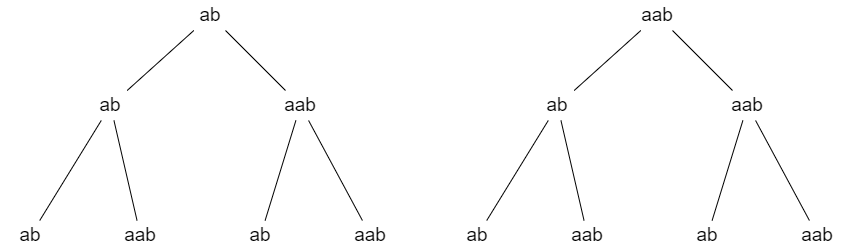

# 公平的棋局

!!! note "题目"

    甲、乙两人下象棋，每局甲胜的概率为 $a$，乙胜的概率为 $b$，为简化问题，设没有和局给情况，这意味着对于每一句要么甲赢，要么就乙赢，$a + b = 1$。

    设想甲的棋艺高于乙，即 $a > b$，为了游戏公平性，要适当的打压强者，给予弱者规则上的优惠：

    到什么时候为止，甲连胜了三局，则甲胜；到什么时候为止，乙连胜了两局，则乙胜。

    请你求出「甲最终胜」的概率、「乙最终胜」的概率。

这道题目有点棘手，因为稍不留神就有可能比赛无穷多次都无法分出个结果：
> 甲乙甲乙甲乙··· ···

我们思考一下，如果「甲」最终胜，则最终必有：
> 甲甲甲

那前面必定不可能出现子串：
> 甲甲甲、乙乙

可以是：
> 甲乙、甲甲乙

的任意组合，并且由上面这两种子串的任意多个，任意位置的组合确实可以构成使得「甲最终胜」的比赛可能串。

若一开始是甲赢，并且是甲最终胜，「甲乙」片段出现的可能性为 $p_1 = ab$，「甲甲乙」片段出现的可能性为 $p_2 = aab$；

假设比赛异常焦灼，持续了 $n$ 个上面的片段之后比赛才使得「甲最终胜」，对于每一个片段的位置，要么出现「甲乙」，要么出现「甲甲乙」，这两个片段出现的概率是等可能的，所以比赛出现了 $n$ 个片段之后，甲最终胜的概率为，可以想象成权值相等的二叉树：
> $p = (ab + aab) ^ n \times aaa$ 

这「二叉选择树」的概率为：$(ab + aab) \times (ab + aab) \times (ab + aab) = (ab + aab) ^ 3$

由于 $n$ 可以取 $0、1、2、\cdots 、\infty$，将每一个 $n$ 对应的甲最终胜的概率求和：
> $p_{all} = [\sum_{n = 0}^{\infty}(ab + aab) ^ n] \times aaa$
> 
> 根据等比求和公式：$s_n = \frac{a_1(1 - q^n)}{1 - q}$，所以 $\sum_{n = 0}^{\infty}(ab + aab) ^ n \rightarrow \frac{1}{1 - ab(1 + a)}$
> 
> 所以：$p_{all} = \frac{a^3}{1 - ab(1 + a)}$

---

若一开始是乙胜，并且还是「甲最终胜」的概率和上面类似，只是多乘了一个 $b$:
> $p_{all} = \frac{a^3b}{1 - ab(1 + a)}$

---

综上所述，甲最终胜的概率为：
> $p = \frac{a^3(1 + b)}{1 - ab(1 + a)}$

对于乙最终胜，也是按照这种思考方式，快上课了就暂时不写了，有空再补。