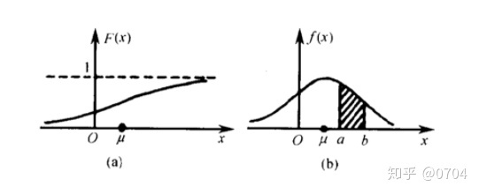

# 分布函数与概率密度函数

设连续性型随机变量 $X$ 的分布函数有：$F(x)$，则 $F(x)$ 的导函数 $f(x) = {F}'(x)$ 就称为概率密度函数。

如左下图为某随机变量 $X$ 的分布函数图，右下图为其概率密度函数：

!!! info 

    {width=100%}

如果我们要求 $P(a \leq X \leq b)$ 的概率，则只需要求 $F(b) - F(a)$ 即可，但是对应于概率密度函数，则是求 $f(a) \sim f(b)$ 这一段的积分：$\int_{a}^{b}f(x)dx$；

为什么我们要普遍选择概率密度函数而不是选择分布函数来感知连续型随机变量的分布呢，答案就是可以直接从概率密度函数图的面积就可以整体感知随机变量的大致取值占比。