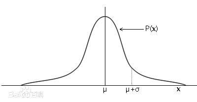

# 正太分布

如果一个随机变量具有概率密度函数：

$$
f(x) = (\sqrt{2\pi}\sigma)^{-1}e^{-\frac{(x - \mu) ^ 2}{2 \sigma ^ 2}}
$$

则 $X$ 为正太随机变量，并记为 $X \sim N(\mu, \sigma ^ 2)$，这里的 $N$ 是 {== normal ==} 的意思，正太分布也叫常态分布，比较常见到。

**查表：**

$\Phi(\frac{X - \mu}{\sigma})$ 代表的是分布函数 $F(X)$ 的概率；

如果 $\Phi(\frac{X - \mu}{\sigma}) < 0$ 是查不到的，这时 $\Phi(\frac{X - \mu}{\sigma}) = 1 - |\Phi(\frac{X - \mu}{\sigma})|$。

