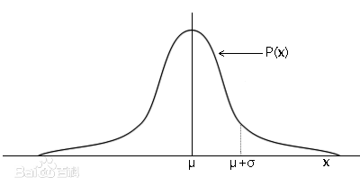

# 正太分布简单例题

!!! question

    设 $X \sim N(3, 2 ^ 2)$

    求 $P\{-4 < X \leq 10\}$ 的概率；

    确定 $c$ 使得 $P\{X > c\} = P\{X \leq c\}$

随机变量 $X$ 的概率密度函数若满足：
> $f(x) = (\sqrt{2\pi}\sigma)^{-1}e^{-\frac{(x - \mu) ^ 2}{2 \sigma ^ 2}}$

就称随机变量 $X$ 满足正太分布，记作：$X \sim N(\mu, \sigma ^ 2)$ mu、sigma 的平方。

对于 $X \sim N(\mu, \sigma ^ 2)$ 化为标准正太分布 $X \sim N(0, 1)$，只需让 $X = \frac{X - \mu}{\sigma}$，查表的时候也是化为标准正太分布：
> 查 $\Phi(\frac{X - \mu}{\sigma})$

若 $\frac{X - \mu}{\sigma} < 0$ 我们是查不到的，当时由于正太分布的概率密度函数关于 $x = 0$ 轴对称，所以:

> $\Phi(\frac{X - \mu}{\sigma}) = 1 - \Phi(|\frac{X - \mu}{\sigma}|)$

---

我们一般不用写出概率密度函数，怎么求 $P\{-4 < X \leq 10\}$ 的概率呢？

由于随机变量 $X \sim N(3, 2 ^ 2)$，所以查表：
> $\Phi(\frac{-4 - 3}{2} = -3.5) = 1 - \Phi(3.5)$，$\Phi(\frac{10 - 3}{2} = 3.5)$

所以 $P\{-4 < X \leq 10\} = \Phi(3.5) - (1 - \Phi(3.5)) = 2 \Phi(3.5) - 1$

查表得：$\Phi(3.5) = 0.9998$，所以：
> $2 \Phi(3.5) - 1 = 0.9996$

---

若 $P\{X > c\} = P\{X \leq c\}$ 则 $c$ 将会是概率密度函数 $f(x)$ 的中间平分线，即:

> $x = \mu$，所以 $c = \mu$。

