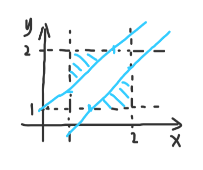

# 约定相遇

!!! note "题目"

    甲、乙二人约定 $1$ 点到 $2$ 点之间在某处碰面，约定先到者要等候 $10$ 分钟才能离去。

    设想甲、乙二人各自随意地在 $1 \sim 2$ 点之间选一个时刻到达该处。

    问 「甲、乙二人能碰上」这个事件 $E$ 发生的概率是多少？

若设甲到达的时间为 $x$，乙到达的时间为 $y$，则 $x、y$ 可以任意出现在 $1 \sim 2$ 的时间点中

若甲、乙相遇，需要满足：
> $|x - y| \leq 10$

用坐标图来表示：

{ width=40% }

只有被两条直线：$y = x - 10$、$y = x + 10$ 所夹住的白色区域面积才是可以相遇的点 $(x, y)$ 的分布区域，该面积与总面积的比值就是可能相遇的概率。