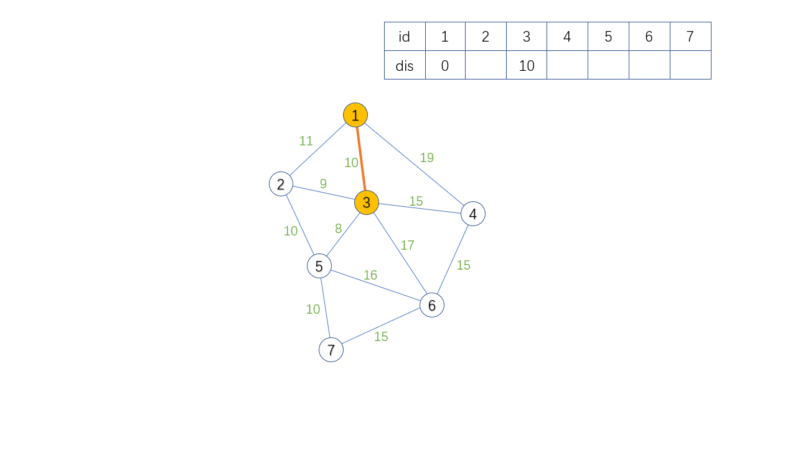

# dijkstra 算法正权路径求最短路

!!! question

    给定一个无向图，顶点数为 $n$，边数为 $m$，并且顶点编号为 $1 \sim n$。

    该无向图可能有环、重边、自环。

    **输入格式**

    第一行输入两个整数 $n, m$ 分别代表图的顶点数和边数。

    接下来的 $m$ 行，每行 $3$ 个整数 $a, b, dis$ ，分别代表从编号为 $a$ 的顶点距离编号为 $b$ 的顶点的距离。

    **输出格式**

    输出一个整数代表从起点 $1$ 到达终点 $n$ 的最短路径，如果无法到达终点 $n$，就输出 $-1$。

## 代码设计思路

1. 从起点 $s$ 出发，将起点 $s$ 的所有邻接点都丢入集合 $A$ 中；
2. 然后获取集合 $A$ 中距离起点 $s$ 最近的点 $v$，并将 $v$ 的所有邻接点也丢入集合 $A$ 中，然后将 $v$ 从集合 $A$ 中抛弃并且之后的所有步骤都不能再使用顶点 $v$；
3. 重复上述第二步操作，直到集合 $A$ 为空。

在不断将新的顶点放入集合 $A$ 的过程中，要不断的记录下当前顶点距离起点 $s$ 的最小值

$dijkstra$ 算法求的是一个连通分量内所有的顶点距离起点 $s$ 的最短路径，本质上要将其想象成是一个 **扩散** 的过程，也可以现象成是一个特殊版本的基于「优先队列」实现的 `BFS`。

$dijkstra$ 每扩散一次，就能求出一个点到达起点的最短路径，是一个贪心策略，例如下图：



从起点 $1$ 出发能扩散的路径有：
> [1, 2, 11]、[1, 3, 10]、[1, 4, 19]

我们能确定的出最短路径的点是 $3$，从起点到达 $3$ 号点的最短路径是 $10$；你可以用反证法，假设还有一条路径从起点出发到达 $3$ 的路径长度是小于 $10$ 的，事实上，从 $1$ 出发的话肯定得绕过边 [1, 2, 11]、[1, 4, 19]，并且由于路径都是正数，所以一定会比路径 [1, 3, 10] 更长，因此 [1, 3, 10] 是从 $1$ 出发到达 $3$ 的最短路径。

贪心策略就是按照这种小想法不断延伸的，我们再考虑下一个可确定最短路径的点是哪个？

先列出可扩散的路径有哪些:
> [1, 2, 11]、[1, 4, 19]、[1, 3, 2, 19]、[1, 3, 5, 18]、[1, 3, 6, 27]、[1, 3, 4, 25]
>
> 我们排个序吧，有点乱蹋蹋的
>
> [1, 2, 11]、[1, 3, 5, 18]、[1, 4, 19]、[1, 3, 2, 19]、[1, 3, 4, 25]、[1, 3, 6, 27]

我们能确定的下一个点是 $2$ 到达起点的距离是 $11$，你可以假设：如若不然，必定要绕过剩下的其中某条路径 [1, 3, 5, 18]、[1, 4, 19]、[1, 3, 2, 19]、[1, 3, 4, 25]、[1, 3, 6, 27] 才能再次再次回到点 $2$，由于路径都为正数，所以相加之后一定更大了，不加之前单单是绕过这些剩下的路径都已经比 [1, 2, 11] 大了，再加上一些正数，岂不是更大？对吧。

贪心的策略就是这样，简单用例子描述一下。

**dijstra 求最短路是适用于有环图的。**

借助优先队列的时间复杂度是 $mlogm$，$m$ 是边的数量，一般都大于顶点数 $n$。

!!! note "代码参考"

    ```c++
    int n, m;
    int g[N], e[N], d[N], ne[N], cnt;
    int dis[N], vis[N];

    void add(int a, int b, int c)
    {
        cnt ++; e[cnt] = b; d[cnt] = c; ne[cnt] = g[a]; g[a] = cnt;
    }

    struct Node
    {
        int u, w;
        Node(int a = 0, int b = 0) : u(a), w(b) {}
        bool operator<(const Node& t) const { return w > t.w; }
    };

    typedef priority_queue<Node> pqn;

    // 求 u 到 v 的最短路径长度
    int dijkstra(int u, int v)
    {
        pqn qu; memset(dis, 0b01111111, sizeof dis);
        qu.push({u, dis[u] = 0});
        while (qu.size())
        {
            Node t = qu.top(); qu.pop();
            if (vis[t.u]) continue; vis[t.u] = 1;
            for (int x = g[t.u]; x; x = ne[x])
                if (dis[e[x]] > t.w + d[x])
                    qu.push({e[x], dis[e[x]] = t.w + d[x]});
        }
        // 0b01111111 = 0x7f
        return dis[v] == 0x7f7f7f7f ? -1 : dis[v];
    }

    void solve()
    { 	oier
        /* =========================== */
        
        cin >> n >> m; 
        for (int i = 1; i <= m; i ++) 
        {
            int a, b, c; cin >> a >> b >> c; add(a, b, c);
        }
        cout << dijkstra(1, n) << endl;
        
        /* =========================== */
    }
    ```

??? success "Code"

    ```c++
    #include <iostream>
    #include <iomanip>
    #include <algorithm>
    #include <cstdio>
    #include <cstdlib>
    #include <cstring>
    #include <string>
    #include <vector>
    #include <queue>
    #include <deque>
    #include <stack>
    #include <map>
    #include <set>
    #include <unordered_map>
    #include <unordered_set>

    using namespace std;
    #define endl '\n'
    #define pique priority_queue
    #define oier \
                ios_base::sync_with_stdio(false);\
                cin.tie(nullptr); cout.tie(nullptr);

    #define cf int t; cin >> t; while (t --)
            
    #define upfor(i, l, r) for (i = (l); i <= (r); i ++)
    #define downfor(i, l, r) for (i = (r); i >= (l); i --)
                
    // #define int long long
    typedef long long LL;
    typedef long double LD;
    //typedef __int128_t int128;

    const int inf = ~(1 << 31);  // 正无穷
    const int ninf = (1 << 31);  // 负无穷

    const LL infll = ~(1ll << 63); // 正无穷
    const LL ninfll = (1ll << 63); // 负无穷

    inline LL rll() { oier LL x; cin >> x; return x; }
    inline int rint() { oier int x; cin >> x; return x; }

    /*
        0b00111111 = 0x3f
        0b01111111 = 0x7f
        0b11111111 = -1
    */

    const int N = int (1e7 + 10);

    // 由于情报不足，只能透过「试行错误」来获取。

    /* =============================代码区============================= */

    int n, m;
    int g[N], e[N], ne[N], d[N], cnt;
    int dis[N], vis[N];

    void add(int a, int b, int c) 
    { 
        cnt ++; e[cnt] = b; d[cnt] = c; ne[cnt] = g[a]; g[a] = cnt;
    }

    struct Node
    {
        int u, w; 
        Node(int a = 0, int b = 0) { u = a, w = b; }
        // 头节点与其他比较小于号的内容
        bool operator<(const Node& point) const { return w > point.w; }
    };

    // 查找 u 到 v 的最短路径
    int dijkstra(int u, int v)
    {
        priority_queue<Node> qu;
        memset(dis, 0x7f, sizeof dis);
        qu.push({u, 0}); dis[u] = 0;
        while (qu.size())
        {
            Node t = qu.top(); qu.pop();
            if (vis[t.u]) continue; vis[t.u] = 1;
            for (int x = g[t.u]; x; x = ne[x])
                if (dis[e[x]] > t.w + d[x])
                    qu.push({e[x], dis[e[x]] = t.w + d[x]});
        }
        return dis[v] == 0x7f7f7f7f ? -1 : dis[v];
    }

    void solve()
    { 	oier
        /* =========================== */
        
        cin >> n >> m;
        for (int i = 1; i <= m; i ++) 
        {
            int a, b, c; cin >> a >> b >> c; add(a, b, c); add(a, b, c);
        }
        
        cout << dijkstra(1, n) << endl;
        /* =========================== */
    }

    /* =============================代码区============================= */

    /**
    *                             _ooOoo_
    *                            o8888888o
    *                            88" . "88
    *                            (| -_- |)
    *                            O\  =  /O
    *                         ____/`---'\____
    *                       .'  \\|     |//  `.
    *                      /  \\|||  :  |||//  \
    *                     /  _||||| -:- |||||-  \
    *                     |   | \\\  -  /// |   |
    *                     | \_|  ''\---/''  |   |
    *                     \  .-\__  `-`  ___/-. /
    *                   ___`. .'  /--.--\  `. . __
    *                ."" '<  `.___\_<|>_/___.'  >'"".
    *               | | :  `- \`.;`\ _ /`;.`/ - ` : | |
    *               \  \ `-.   \_ __\ /__ _/   .-` /  /
    *          ======`-.____`-.___\_____/___.-`____.-'======
    *                             `=---='
    *          ^^^^^^^^^^^^^^^^^^^^^^^^^^^^^^^^^^^^^^^^^^^^^
    *                     佛祖保佑        永无BUG
    *            佛曰:
    *                   写字楼里写字间，写字间里程序员；
    *                   程序人员写程序，又拿程序换酒钱。
    *                   酒醒只在网上坐，酒醉还来网下眠；
    *                   酒醉酒醒日复日，网上网下年复年。
    *                   但愿老死电脑间，不愿鞠躬老板前；
    *                   奔驰宝马贵者趣，公交自行程序员。
    *                   别人笑我忒疯癫，我笑自己命太贱；
    *                   不见满街漂亮妹，哪个归得程序员？
    **/

    /* ========================佛祖保佑, 永无bug======================== */

    int main()
    {
        // oier cf solve(); return 0;
        oier solve(); return 0;
    }
    ```