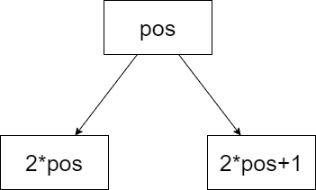

# 二叉堆

以小根堆为例，小根堆，顾名思义根是最小的，任意一个节点的值要小于或等于它的儿子节点的值。

## 数组版

假设有数组：`q[N] = {, 1, 4, 5, 7, 9, 2, 8}`，数据个数：`q[0] = 7`，默认数据域从下标 1 开始, `q[0]` 存储数据个数。



```c++
const int N = int (1e6 + 10);
int q[N];
```

### down 向下调整

先找到当前节点中的最小儿子节点（可能只有一个左儿子，也可能没有儿子，没有就直接退出循环，不能继续向下调整了）如果最小的儿子大于当前节点，则调整结束，否则交换两者位置，pos 下移到最小儿子的位置，继续向下调整。

```c++
void down(int q[], int pos)
{
    while (2 * pos <= q[0])
    {
        int t = 2 * pos;
        if (t + 1 <= q[0] && q[t + 1] < q[t]) t = t + 1;
        if (q[pos] > q[t]) swap(q[pos], q[t]), pos = t;
        else break;
    }
}
```

### up 向上调整

如果当前节点的父节点存在（即 pos / 2 > 0）并且还大于当前节点的话，就要交换两者的值，pos 上移到 pos / 2，然后继续执行向上调整。

```c++
void up(int q[], int pos)
{
    while (pos / 2 > 0)
    {
        if (q[pos] < q[pos / 2]) swap(q[pos], q[pos / 2]), pos /= 2;
        else break;
    }
}

```

### heap 将数组调整成堆

写法一：（最简单的写法）

```c++
void heap(int q[])
{
    for (int i = q[0]; i; i --) down(q, i);
}
```

写法二：（从最后一个带儿子的节点的开始）

假设最后一个带儿子的节点是 $k$ ，假设只有一个儿子，则 $2k = q[0]$ 且 $q[0]$ 为偶数，所以 $k = q[0] / 2$

假设有两个儿子节点，则 $2k + 1 = q[0]$ 且 $q[0]$ 为奇数，所以 $k = (q[0] - 1) / 2$ ，由于c++向下取值的特性，也可写成：$k = q[0] / 2$

读者可以画几个图细细研讨为什么最后一个带儿子的节点只有一个儿子节点时，总节点数为偶数；有两个儿子节点时，总节点数为奇数。

```c++
void heap(int q[])
{
    for (int i = q[0] / 2; i; i --) down(q, i);
}
```

### push 压入数据

将新数据放在最后的位置，再执行向上调整

```c++
void push(int q[], int x)
{
    q[++q[0]] = x; up(q, q[0]);
}
```

### pop、front 删除、访问最小值

```c++
int front(int q[])
{
    return q[1];
}

// 想交换当前元素和最后一个元素，长度减一，对根部 1 执行向下调整
void pop(int q[])
{
    swap(q[1], q[q[0]--]); down(q, 1);
}
```

### empty、size

```c++
bool empty(int q[])
{
    return q[0] == 0;
}

int size(int q[])
{
    return q[0];
}
```

??? note "数组版代码"

    ```c++
    const int N = int (1e6 + 10);
    int q[N];

    void down(int q[], int pos)
    {
        while (2 * pos <= q[0])
        {
            int t = 2 * pos;
            if (t + 1 <= q[0] && q[t + 1] < q[t]) t = t + 1;
            if (q[pos] > q[t]) swap(q[pos], q[t]), pos = t;
            else break;
        }
    }

    void up(int q[], int pos)
    {
        while (pos / 2 > 0)
        {
            if (q[pos] < q[pos / 2]) swap(q[pos], q[pos / 2]), pos /= 2;
            else break;
        }
    }

    // void heap(int q[])
    // {
    //     for (int i = q[0]; i; i --) down(q, i);
    // }

    void heap(int q[])
    {
        for (int i = q[0] / 2; i; i --) down(q, i);
    }

    void push(int q[], int x)
    {
        q[++q[0]] = x; up(q, q[0]);
    }

    int front(int q[])
    {
        return q[1];
    }

    void pop(int q[])
    {
        swap(q[1], q[q[0]--]); down(q, 1);
    }

    bool empty(int q[])
    {
        return q[0] == 0;
    }

    int size(int q[])
    {
        return q[0];
    }
    ```