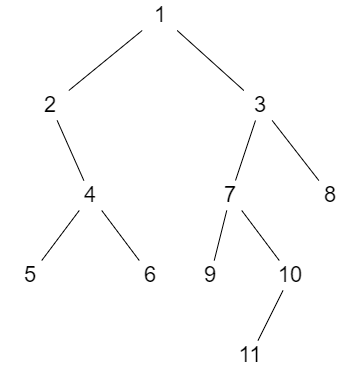

# 二叉树

## 结构体定义

```c++
struct Node
{
    int v; Node* l, * r;
    Node(int val = 0, Node* left = nullptr, Node* right = nullptr)
    {
        v = val; l = left; r = right;
    }
};
```

## pre 前序遍历

方法一：「递归」

```c++
// 「递归版」 前序遍历二叉树 a
void pre(Node* a)
{
    if (!a) return;
    printf ("%d ", a->v);
    pre(a->l); pre(a->r);
}
```

方法二：「循环 + 栈」

```c++
// 「循环 + 栈」 前序遍历二叉树 a
void pre(Node* a)
{
    stack<Node*> st; 
    st.push(a);
    while (st.size())
    {
        a = st.top(); st.pop();
        if (!a) continue;
        printf ("%d ", a->v);
        st.push(a->r); st.push(a->l);
    }
}
```

## in 中序遍历

方法一：「递归」

```c++
// 「递归版」 中序遍历二叉树 a
void in(Node* a)
{
    if (!a) return;
    in(a->l); 
    printf ("%d ", a->v);
    in(a->r);
}
```

方法二：「循环 + 栈」

```c++
// 「循环+栈」 中序遍历二叉树 a
void in(Node* a)
{
    stack<pair<Node*, int>> st;
    st.push({a, 0});
    while (st.size())
    {
        auto node = st.top(); st.pop();
        if (!node.first) continue;
        if (node.second == 1) 
        {
            printf ("%d ", node.first->v);
            continue;
        }
        st.push({node.first->r, 0});
        st.push({node.first, 1});
        st.push({node.first->l, 0});
    }
}
```

## post 后序遍历

方法一：「递归」

```c++
// 「递归版」 后序遍历二叉树 a
void post(Node* a)
{
    if (!a) return;
    post(a->l);
    post(a->r);
    printf ("%d ", a->v);
}
```

方法二：「循环 + 栈」

```c++
// 「循环+栈」 后序遍历二叉树 a
void post(Node* a)
{
    stack<pair<Node*, int>> st;
    st.push({a, 0});
    while (st.size())
    {
        auto node = st.top(); st.pop();
        if (!node.first) continue;
        if (node.second == 1)
        {
            printf ("%d ", node.first->v);
            continue;
        }
        st.push({node.first, 1});
        st.push({node.first->r, 0});
        st.push({node.first->l, 0});
    }
}
```

## 已知「前序、中序」转「后序」



前序遍历为：$[1, 2, 4, 5, 6, 3, 7, 9, 10, 11, 8]$

中序遍历为：$[2, 5, 4, 6, 1, 9, 7, 11, 10, 3, 8]$

前序遍历的第一个节点 1 一定是根节点，我们在中序遍历中找到 1 所在的位置：$[[2, 5, 4, 6], 1, [9, 7, 11, 10, 3, 8]]$

则在中序遍历内 $[2, 5, 4, 6]$ 就是 $1$ 的左子树，$[9, 7, 11, 10, 3, 8]$ 就是 $1$ 的右子树。

我们接着分析前序遍历的第二个节点：2，2 一点是 1 的左子树的根节点，我们按照上面的逻辑在 1 的左子树中序遍历的结果 $[2, 5, 4, 6]$ 中找到 2 的位置，并划分左右子树

不断的通过上述逻辑去推导，就能把该二叉树推导出来。

```c++
int pres[N]; // 前序遍历的结果，数据域从 1 开始
int ins[N];  // 中序遍历的结果，数据域从 1 开始
int posts[N];// 后序遍历的结果，数据域从 1 开始
int cur = 1, po = 1;
```

前序+中序 = 二叉树：

```c++
// 前序+中序 = 二叉树
Node* prein(int l, int r)
{
    if (l > r) return nullptr;
    int p = l;
    while (ins[p] != pres[cur]) p ++;
    return new Node(pres[cur ++], prein(l, p - 1), prein(p + 1, r));
}
```

前序+中序 = 后序：

```c++
// 前序+中序 = 后序
void prein(int l, int r)
{
    if (l > r) return;
    int p = l;
    while (ins[p] != pres[cur]) p ++;
    int t = pres[cur ++];
    prein(l, p - 1);
    prein(p + 1, r);
    posts[po ++] = t;
}
```

## 已知「后序、中序」转「前序」


后序遍历为：$[5, 6, 4, 2, 9, 11, 10, 7, 8, 3, 1]$

中序遍历为：$[2, 5, 4, 6, 1, 9, 7, 11, 10, 3, 8]$

我们从后序遍历数组的后面往前面分析：

后序遍历的最后一个节点 $1$ 一定是树的根节点，在中序遍历中找到 $1$ 出现的位置划分左右子树：

$$
[[2, 5, 4, 6], 1, [9, 7, 11, 10, 3, 8]]
$$

我们再分析后序遍历数组的倒数第二个节点 $3$，该节点 $3$ 一定是 $1$ 的右子树的根节点，在右子树的中序遍历数组中划分左右子树：

$$
[[9, 7, 11, 10], 3, [8]]
$$

按照上面的逻辑不断推到下去就能推出原树的模样。

```c++
int pres[N]; // 前序遍历的结果，数据域从 1 开始
int ins[N];  // 中序遍历的结果，数据域从 1 开始
int posts[N];// 后序遍历的结果，数据域从 1 开始
int cur = n, pr = 1; // n 是二叉树的节点个数
```

后序 + 中序 = 二叉树：

```c++
// 后序 + 中序 = 二叉树
Node* postin(int l, int r)
{
    if (l > r) return nullptr;
    int p = l;
    while (ins[p] != posts[cur]) p ++;
    return new Node(posts[cur --], postin(p + 1, r), postin(l, p - 1));
}
```

后序 + 中序 = 前序：

```c++
// 后序 + 中序 = 前序
void postin(int l, int r)
{
    if (l > r) return;
    int p = l;
    while (ins[p] != posts[cur]) p ++;
    int t = posts[cur --];
    postin(p + 1, r);
    postin(l, p - 1);
    pres[pr ++] = t;
}
```