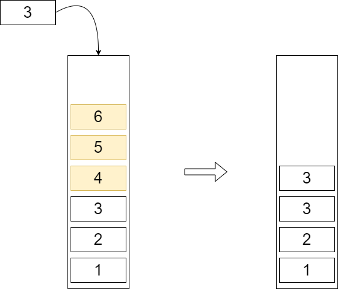

# 单调栈

顾名思义，栈中的数据是单调的，我们这里以「不严格单调递增」为例设计个单调栈。

## push

压入栈时，要保持从栈底到栈顶的单调递增的特性，只能把栈顶比新压入的数据 $x$ 小的元素都剔除出栈，然后压入。

??? info "单调栈压入元素示意图"

    {width=100%}

```c++
void push(int st[], int x)
{
    while (size(st) && front(st) > x) pop(st);
    st[++st[0]] = x;
}
```

??? note "单调栈代码汇总"

    ```c++
    const int N = int (1e6 + 10);
    int q[N];

    bool empty(int st[])
    {
        return !st[0];
    }

    int size(int st[])
    {
        return st[0];
    }

    int front(int st[])
    {
        return st[st[0]];
    }

    void pop(int st[])
    {
        st[0]--;
    }

    void push(int st[], int x)
    {
        while (size(st) && front(st) > x) pop(st);
        st[++st[0]] = x;
    }
    ```

## 例题：[830. 单调栈](https://www.acwing.com/problem/content/832/)

!!! note "[830. 单调栈](https://www.acwing.com/problem/content/832/)"

    给定一个长度为 $N$ 的整数数列，输出每个数左边第一个比它小的数，如果不存在则输出 $−1$。

    思路：不断维护一个严格单调递增的栈，要找左边第一个比该数小的数，就先把该数放入栈中，然后再取出，如果单调栈为空，就说明该数左边没有第一个比该数小的数，如果还有元素，则栈顶元素就是答案

    为什么可以直接丢弃左边比该数（设为 $x$）大或者等的数？那些比该数 $x$ 大的数是一定不会作为右边其他元素左边第一个小的数出现，因为有更小的更靠右的数 $x$ 可以选择，因此可以大胆删除。

    ??? note "代码参考"
        ```c++
        // 即使是不成熟的尝试，

        const int N = int (1e6 + 10);
        int q[N], n;

        bool empty(int st[])
        {
            return !st[0];
        }

        int size(int st[])
        {
            return st[0];
        }

        int front(int st[])
        {
            return st[st[0]];
        }

        void pop(int st[])
        {
            st[0]--;
        }

        void push(int st[], int x)
        {
            while (size(st) && front(st) >= x) pop(st);
            st[++st[0]] = x;
        }

        void solve(void)
        {
            scanf ("%d", &n);
            while (n --)
            {
                int t; scanf ("%d", &t);
                push(q, t); pop(q); 
                if (size(q)) printf ("%d ", front(q));
                else printf ("-1 ");
                push(q, t);
            }
        }

        // 也胜于胎死腹中的策略。
        ```