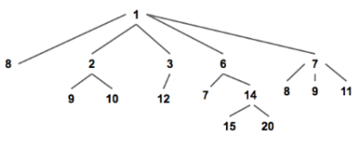
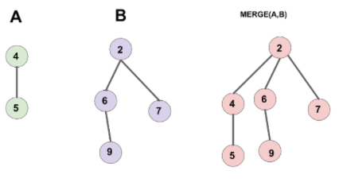
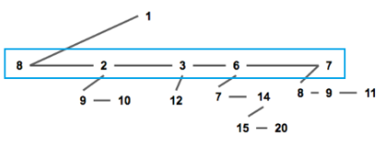
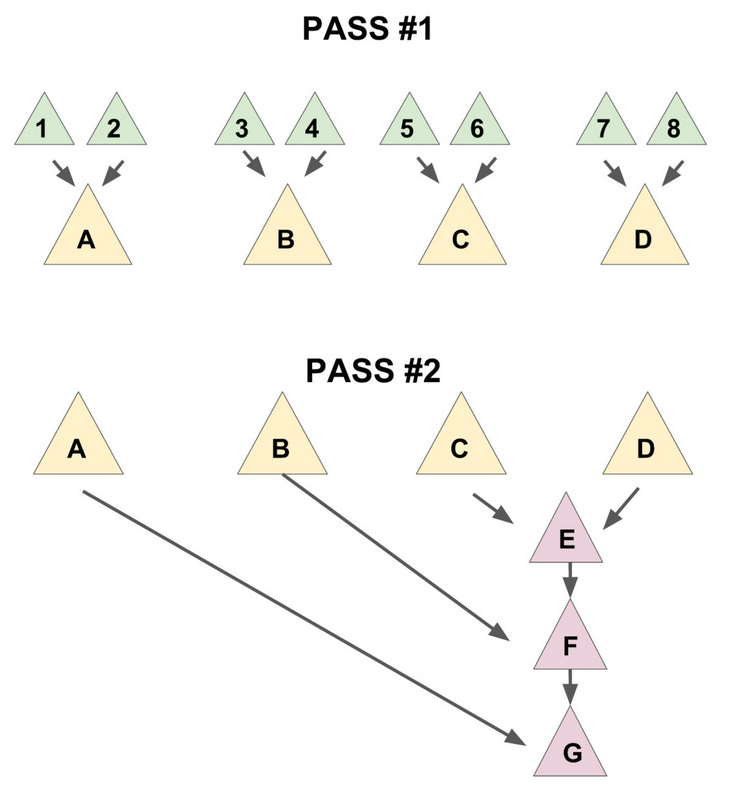

# 配对堆

配对堆是一个支持「插入」，「查询」/「删除」最小值，「合并」，「修改」元素等操作的数据结构，也就是俗称的可并堆。



通常我们使用「左儿子右兄弟表示法」储存一个配对堆（如下图）


## 结构体定义

```c++
struct Node
{
    int v;
    Node* ch, * si;
    Node(int val = 0, Node* child = nullptr, Node* sibling = nullptr)
    {
        v = val; ch = child; si = sibling;
    }
};
```

## empty 

```c++
bool empty(Node* a)
{
    return !a;
}
```

## meld 合并两个配对堆

配对堆的合并操作极为简单，直接把根节点权值较大的那个配对堆设成另一个的儿子就好了。



```c++
Node* meld(Node* a, Node* b)
{
    if (!a || !b) return a ? a : b;
    if (a->v > b->v) swap<Node*>(a, b);
    b->si = a->ch; a->ch = b;
    return a;
}
```

## meld 插入数据

直接将「新元素」当作一个配对堆执行合并操作就行。

```c++
Node* meld(Node* a, int x)
{
    Node* t = new Node(x);
    return meld(a, t);
}
```

## front 获取最小值

```c++
int front(Node* a)
{
    return a->v;
}
```

## pop 删除堆根

上述的几个操作都很「慵懒」，关键是取出最小值后，次最小值要如何寻找呢？



如上图，最小值是 1，次最小值一定出现在「蓝色框」中，我可以暴力遍历蓝色框找出最小值，但我们一旦删除操作执行过多时，时间复杂度就会不断退化到 O(n) , 因此我们要求在删除最小值时，对该配对堆存储结构进行优化

把儿子们 **从左往右** 两两配成一对，用 `meld` 操作把被配成同一对的两个儿子合并到一起（见下图 1)，再将新产生的堆 **从右往左** 暴力合并在一起（见下图 2）。

删除操作均摊下来的时间复杂度为：$O(log(n))$

$O(log(n))$是什么概念：$log(1267650600228229401496703205376) = 100$ 几乎约等于常数。



详情见 [oi-wiki](https://oiwiki.org/ds/pairing-heap/)

```c++
Node* merges(Node* a)
{
    if (!a || !a->si) return a;
    Node* b = a->si;
    Node* c = b->si;
    a->si = b->si = nullptr; // 分离 a 和 b
    return meld(meld(a, b), merges(c));
}

Node* pop(Node* a)
{
    Node* t = merges(a->ch);
    delete a;
    return t;
}
```

??? note "配对堆代码汇总"

    ```c++
    struct Node
    {
        int v;
        Node* ch, * si;
        Node(int val = 0, Node* child = nullptr, Node* sibling = nullptr)
        {
            v = val; ch = child; si = sibling;
        }
    };
    
    bool empty(Node* a)
    {
        return !a;
    }

    Node* meld(Node* a, Node* b)
    {
        if (!a || !b) return a ? a : b;
        if (a->v > b->v) swap<Node*>(a, b);
        b->si = a->ch; a->ch = b;
        return a;
    }

    Node* meld(Node* a, int x)
    {
        Node* t = new Node(x);
        return meld(a, t);
    }

    int front(Node* a)
    {
        return a->v;
    }

    Node* merges(Node* a)
    {
        if (!a || !a->si) return a;
        Node* b = a->si;
        Node* c = b->si;
        a->si = b->si = nullptr; // 分离 a 和 b
        return meld(meld(a, b), merges(c));
    }

    Node* pop(Node* a)
    {
        Node* t = merges(a->ch);
        delete a;
        return t;
    }
    ```