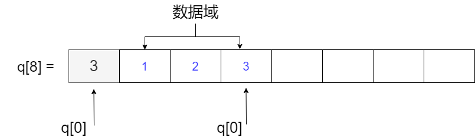

# 栈

栈是一种「先进后出」的数据结构。

## 数组实现栈

用数组实现栈，代码简洁，效率也高，速度也快

给定一个数组 $q[N]$，数组的第一个元素 $q[0]$ 存储栈的数据个数，也代表最后一个元素的下标，如下图：



### empty

如果 $q[0] = 0$ ，说明栈为空

``` c++
#define st_empty(st) (st[0] == 0) // 判断栈是否为 空
```

### full

如果 $q[0] = N - 1$，说明数组空间已满

``` c++
#define st_full(st) (st[0] == (N - 1)) // 栈的长度最大为 N - 1
```

### push

插入数据时：`q[++q[0]] = x`

``` c++
#define st_push(st, x) (st[++st[0]] = (x)) // 放入数据
```

### pop

取出数据时：`q[q[0]--]`

``` c++
#define st_pop(st) (st[st[0]--]) // 拿出数据

#define st_top(st) (st[st[0]]) // 访问栈顶元素
```

??? note "栈-代码参考"
    ```cpp linenums="1"
    const int N = int (1e5 + 10);

    int q[N]; // 使用 q[0] 表示 栈 的数据个数

    #define st_size(st) (st[0]) // 栈的数据个数

    #define st_full(st) (st[0] == (N - 1)) // 栈的长度最大为 N - 1

    #define st_empty(st) (st[0] == 0) // 判断栈是否为 空

    #define st_push(st, x) (st[++st[0]] = (x)) // 放入数据

    #define st_pop(st) (st[st[0]--]) // 拿出数据

    #define st_top(st) (st[st[0]]) // 访问栈顶元素
    ```

## 结构体

### 结构体定义

```c++ 
struct Node
{
    int v;
    Node* ne;
    Node(int val = 0, Node* next = nullptr)
    {
        v = val; ne = next;
    }
};
```

### 头插法

定义一个 `st_top` 指针指向开头，初始化为「空」

``` c++
Node* st_top = nullptr;
```

### push 压栈

假设我们要加入一个数据，我们采用头插法不断维护栈顶即可

``` c++
void push(Node*& st_top, int x)
{
    Node* t = new Node(x, st_top);
    st_top = t;
}
```

### pop 取出栈顶

```c++
int top(Node* st_top)
{
    return st_top->v;
}

void pop(Node*& st_top)
{
    Node* p = st_top; 
    st_top = st_top->ne;
    delete p;
}
```

### empty

```c++
bool empty(Node* st_top)
{
    return !st_top;
}
```

??? note "结构体-代码汇总"

    ```c++ linenums="1"
    struct Node
    {
        int v;
        Node* ne;
        Node(int val = 0, Node* next = nullptr)
        {
            v = val; ne = next;
        }
    };

    Node* st_top = nullptr;

    void push(Node*& st_top, int x)
    {
        Node* t = new Node(x, st_top);
        st_top = t;
    }

    int top(Node* st_top)
    {
        return st_top->v;
    }

    void pop(Node*& st_top)
    {
        Node* p = st_top; 
        st_top = st_top->ne;
        delete p;
    }

    bool empty(Node* st_top)
    {
        return !st_top;
    }
    ```

## 验证栈序列

??? question "验证栈序列"

    给定两个序列 `a` 和 `b`，其中这两个序列的长度相同，且没有重复的元素；这两个序列的长度不超过 $1000$ 且存储的元素都是整数，范围在 $0 \sim 1000$ 子内。

    请你判断序列 `b` 是否可以通过序列 `a` 借助栈所得。

    **样例：**

    输入

    ```
    a = 1 2 3 4 5
    b = 4 5 3 2 1
    ```

    输出 

    ```
    true
    ```

**先找一下有什么规律、特征**

若一开始就输出 4，那么在原序列 `a` 中，比 4 更前面的元素 1 2 3 一定还会滞留在栈中

下一次输出时，要么就输出比 4 更后的元素，要么就输出此时的栈顶元素 3.

如果下次输出 5 ，那么比 5 更前的，还没有输出的元素肯定还会滞留在栈中，我们可以用递归思路来求解此题。

??? success "找规律、找特征的思路"

    ```c++
    vector<int> a, b, c;
    // 3 状态：0 未访问，1 滞留栈中，2 已输出
    int cur, n;
    stack<int> st;

    bool isstack(int pos)
    {
        if (pos == n) return true;
        if (c[b[pos]] == 1) 
        {
            if (st.size() && st.top() == b[pos])
            {
                c[b[pos]] = 2; st.pop();
                return isstack(pos + 1);
            }
            else return false;
        }
        else
        {
            while (cur < n && a[cur] != b[pos])
            {
                if (c[a[cur]] == 0) st.push(a[cur]), c[a[cur]] = 1;
                cur ++;
            }
            if (cur >= n) return false;
            c[b[pos]] = 2;
            return isstack(pos + 1);
        }
    }
    ```

**栈模拟**

先将序列 `a` 中的元素都依次放入栈中

在放的过程中要不断地将栈顶元素与序列 `b` 中的开始元素比较，如果栈顶元素与 `b` 的开始元素相同，就抛弃栈顶元素和 `b` 的开始元素，直到栈为空或不出现栈顶元素与开始元素相同为止。

如果最终 `a` 读完了，但是 `b` 却还有剩，说明不是栈序列，此时的栈也不为空。

该思路本质上是找规律、找特征的思路的简化。

??? success "栈模拟思路"

    ``` c++
    vector<int> a, b;
    stack<int> st;
    int n;

    bool isstack()
    {
        int i = 0, j = 0;
        for (; i < n && j < n; i++)
        {
            st.push(a[i]);
            while (j < n && st.size() && st.top() == b[j])
            {
                st.pop(); j ++;
            }
        }
        return st.size() == 0;
    }
    ```