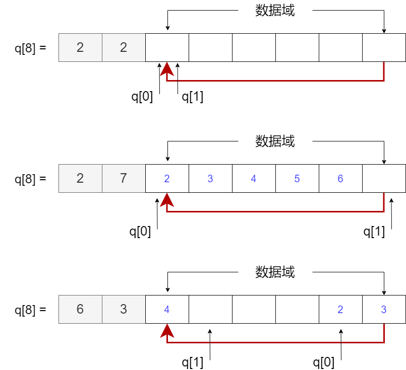

# 队列

队列: 是一种「先进先出」的数据结构。

尾进，头出

## 数组版：循环队列

给定一个数组 `q[N]` ，规定 `q[0]` 指向队头，`q[1]` 指向队尾，并且规定队尾不存放数据，可存放数据的区间为：$[2, N - 1]$

{ width=40%  }

### init 初始化

让 `q[0]` 和 `q[1]` 同时指向 $[2, N - 1]$ 的任意一个位置就行，我这里指向 2

```c++
const int N = int (1e5 + 10);
int q[N]; // 尾进头出，规定 q[0] 代表队头，q[1] 代表队尾

// 初始化队列
void init(int q[])
{ 
    q[0] = q[1] = 2;
}
```

### empty 

如果 `q[0] == q[1]` ，说明队列为空：

```cpp
bool empty(int q[])
{
    return q[0] == q[1];
}
```

### size

如果 `q[0] <= q[1]`， 队列长度为：`q[1] - q[0]`；

如果 `q[0] > q[1]` ，队列长度为：`q[1] - 2 + N - q[0] = q[1] - q[0] + N - 2`

联立上述两种情况：`size = (q[1] - q[0] + N - 2) % (N - 2)`

```cpp
int size(int q[])
{
    return (q[1] - q[0] + N - 2) % (N - 2);
}
```

### full

如果 `size == N - 3`，说明此时已满

```cpp
bool full(int q[])
{
    return size(q) == N - 3;
}
```

### push

执行 `q[q[1]] = x` ，`q[1] ++` 右移

右移时，如果 `q[1] == N` 就要让 `q[1] = 2`，说到底，`q[1]` 的取值范围为：$[2, N - 1] = [0, N - 3] + 2$，所以 
> `q[1] = (q[1] - 2 + 1) % (N - 2) + 2 = (q[1] - 1) % (N - 2) + 2`

```cpp
void push(int q[], int x)
{
    q[q[1]] = x; q[1] = (q[1] - 1) % (N - 2) + 2;
}
```

### pop

同理，删除操作，先记录下 `q[0]` 的值，再执行和上述右移一样的操作。

```cpp
int pop(int q[])
{
    int t = q[q[0]]; q[0] = (q[0] - 1) % (N - 2) + 2;
    return t;
}
```

??? note "代码汇总"

    [模拟队列](https://www.acwing.com/problem/content/831/)

    ```c++ linenums="1"
    const int N = int (1e5 + 10);
    int q[N]; // 尾进头出，规定 q[0] 代表队头，q[1] 代表队尾

    // 初始化队列
    void init(int q[])
    { 
        q[0] = q[1] = 2;
    }

    // 规定 q[0] == q[1] 时，队列为空
    bool empty(int q[])
    {
        return q[0] == q[1];
    }

    // 队列元素个数推导：
    // 如果 q[0] <= q[1]，则 size = q[1] - q[0]
    // 如果 q[1] < q[0]，则 size = q[1] - 2 + N - q[0] = q[1] - q[0] + N - 2
    // 统合上述两种情况：size = (q[1] - q[0] + N - 2) % (N - 2)
    int size(int q[])
    {
        return (q[1] - q[0] + N - 2) % (N - 2);
    }

    // 判断数组元素是否用完，数组长度为 N ，实际可用空间为：N - 3
    bool full(int q[])
    {
        return size(q) == N - 3;
    }

    // 插入元素，队尾右移，q[1] 的取值范围是 [2, N - 1] = [0, N - 3] + 2
    // 因此 q[1] = (q[1] - 2 + 1)% (N - 2) + 2 = (q[1] - 1) % (N - 2) + 2
    void push(int q[], int x)
    {
        q[q[1]] = x; q[1] = (q[1] - 1) % (N - 2) + 2;
    }

    // 获取队头元素
    int front(int q[])
    {
        return q[q[0]];
    }

    // 删除队头元素并返回，队头右移
    int pop(int q[])
    {
        int t = q[q[0]]; q[0] = (q[0] - 1) % (N - 2) + 2;
        return t;
    }
    ```

## 结构体版

规定头节点存放队列的长度信息，头节点的 next 指针才指向实际的队列

### 结构体定义

``` c++
struct Node
{
    int v;
    Node* ne;
    Node(int val = 0, Node* next = nullptr)
    {
        v = val, ne = next;
    }
};
```

### init 初始化

``` c++
Node* head, * tail;

void init()
{
    // 初始时，队列长度为 0，头节点的 v 也是 0
    head = tail = new Node();
}
```

### empty 判断队列是否为空

``` c++
bool empty()
{
    return head == tail;
}
```

### size 队列长度

``` c++
int size()
{
    return head->v;
}
```

### push 尾进

```c++
void push(int x)
{
    tail->ne = new Node(x); tail = tail->ne;
    head->v ++;
}
```

### pop、front 头出

```c++
int front()
{
    return head->ne->v;
}

void pop()
{
    Node* p = head->ne; head->ne = p->ne; delete p;
    head->v --;
}
```

??? note "代码汇总"

    ```c++
    struct Node
    {
        int v;
        Node* ne;
        Node(int val = 0, Node* next = nullptr)
        {
            v = val, ne = next;
        }
    };

    Node* head, * tail;

    void init()
    {
        // 初始时，队列长度为 0，头节点的 v 也是 0
        head = tail = new Node();
    }

    bool empty()
    {
        return head == tail;
    }

    int size()
    {
        return head->v;
    }

    void push(int x)
    {
        tail->ne = new Node(x); tail = tail->ne;
        head->v ++;
    }

    int front()
    {
        return head->ne->v;
    }

    void pop()
    {
        Node* p = head->ne; head->ne = p->ne; delete p;
        head->v --;
    }
    ```