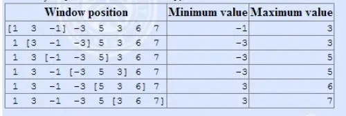

# 例题-滑动窗口

??? question "[题目大意](https://www.luogu.com.cn/problem/P1886)"

    有一个长度为 $n$ 的序列和一个长度为 $k$ 的窗口；

    刚刚开始时，窗口放在 $1 \sim k$ 个数上面，然后输出此时窗口盖住的数据中的最大值和最小值，接着窗口向右一点一个单位，再输出此时盖住的最大值，依此类推。

    如果窗口盖住了最后一个元素并且还输出了此时的最大值和最小值，程序停止。 

    

    **输入格式**

    第一行输入两个整数 $n、k$ 分别代表序列长度和滑动窗口的长度。

    第二行输入 $n$ 个整数。

    **输出格式**

    输出两行，第一行输出最小值，第二行输出最大值。

## 单调队列

对于输出最小值，再窗口吞并的过程中，若新吞入的元素比该窗口中的所有数据都要小，那么之前留在窗口的数据是一定不会被输出的，无论接下来窗口右移多少步，因为有更小的、更靠右边的元素可供选择。

??? note "手写双端队列"
    
    ``` c++  
    template <typename T, int N = int (1e6 + 10)>
    struct deque
    {
        T a[N];
        int l, r;
        deque() { l = 0, r = 1; }
        bool empty() { return (r - l + N) % N == 1; }
        int size() { return (r - l - 1 + N) % N; }
        void push_back(T x) { a[r] = x; r = (r + 1) % N; }
        void push_front(T x) { a[l] = x; l = (l - 1 + N) % N; }
        T back() { return a[(r - 1 + N) % N]; }
        T front() { return a[(l + 1) % N]; }
        void pop_back() { r = (r - 1 + N) % N; }
        void pop_front() { l = (l + 1) % N; }
    };
    ```

??? success "使用手写的双端队列实现单调队列"

    ```c++
    #include <iostream>
    #include <stdlib.h>
    #include <vector>

    using namespace std;
    const int N = 1e6 + 10;

    int n, m, t;
    int mi[N], mx[N], cnt;

    // 自定义双端队列
    template <typename T, int N = int (1e6 + 10)>
    struct deque
    {
        T a[N];
        int l, r;
        deque() { l = 0, r = 1; }
        bool empty() { return (r - l + N) % N == 1; }
        int size() { return (r - l - 1 + N) % N; }
        void push_back(T x) { a[r] = x; r = (r + 1) % N; }
        void push_front(T x) { a[l] = x; l = (l - 1 + N) % N; }
        T back() { return a[(r - 1 + N) % N]; }
        T front() { return a[(l + 1) % N]; }
        void pop_back() { r = (r - 1 + N) % N; }
        void pop_front() { l = (l + 1) % N; }
    };

    #define x first
    #define y second

    int main(void)
    {
        cin >> n >> m;
        deque<pair<int, int>> a, b;
        for (int i = 1; i < m; i ++)
        {
            cin >> t;
            while (a.size() && a.back().x >= t) a.pop_back();
            while (b.size() && b.back().x <= t) b.pop_back();
            a.push_back({t, i}); b.push_back({t, i});
        }
        
        for (int i = m; i <= n; i ++)
        {
            cin >> t;
            while (a.size() && a.back().x >= t) a.pop_back();
            while (b.size() && b.back().x <= t) b.pop_back();
            a.push_back({t, i}); b.push_back({t, i});
            while (a.front().y < i - m + 1) a.pop_front();
            while (b.front().y < i - m + 1) b.pop_front();
            cnt ++; mi[cnt] = a.front().x; mx[cnt] = b.front().x;
        }
        
        for (int i = 1; i <= cnt; i ++) cout << mi[i] << ' ';
        cout << endl;
        for (int i = 1; i <= cnt; i ++) cout << mx[i] << ' ';
        cout << endl;
        
        return 0;
    }
    ```

介绍 `STL` 库中的 `deque` 双端队列

- `push_back`
- `push_front`
- `back`
- `front`
- `pop_back`
- `pop_front`
- `empty`
- `size`

??? success "借助 STL 中的 deque"

    ```c++
    #include <iostream>
    #include <deque>

    using namespace std;
    const int N = 1e6 + 10;

    int n, m, t;
    int mi[N], mx[N], cnt;

    #define x first
    #define y second

    int main(void)
    {
        cin >> n >> m;
        deque<pair<int, int>> a, b;
        for (int i = 1; i < m; i ++)
        {
            cin >> t;
            while (a.size() && a.back().x >= t) a.pop_back();
            while (b.size() && b.back().x <= t) b.pop_back();
            a.push_back({t, i}); b.push_back({t, i});
        }
        
        for (int i = m; i <= n; i ++)
        {
            cin >> t;
            while (a.size() && a.back().x >= t) a.pop_back();
            while (b.size() && b.back().x <= t) b.pop_back();
            a.push_back({t, i}); b.push_back({t, i});
            while (a.front().y < i - m + 1) a.pop_front();
            while (b.front().y < i - m + 1) b.pop_front();
            cnt ++; mi[cnt] = a.front().x; mx[cnt] = b.front().x;
        }
        
        for (int i = 1; i <= cnt; i ++) cout << mi[i] << ' ';
        cout << endl;
        for (int i = 1; i <= cnt; i ++) cout << mx[i] << ' ';
        cout << endl;
        
        return 0;
    }
    ```